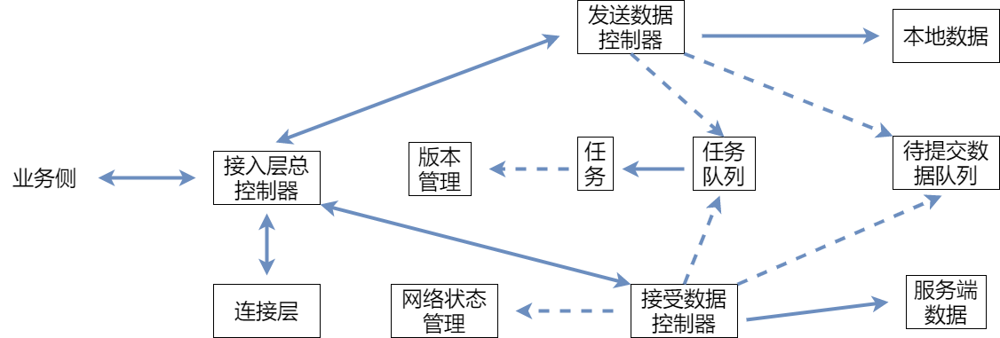

# 在线文档之依赖关系
## 梳理网络层与业务侧依赖
网络层由于历史原因与业务中其他模块耦合严重，其中网络层的代码中对其他模块（包括数据层、离线模块、worker 模块等）的直接引用以及使用事件通信多达 50+处。如果希望重构后的网络层能正常在业务中使用，首先需要将相关依赖全部梳理出来，确认是否可通过适配层的方式进行解耦，让网络层专注于自身的职责功能。  
网络层的与业务层的主要依赖关系，包括：
1. 业务侧为主动方时:
    - 业务侧将数据提交到网络层
    - 业务侧可控制网络层工作状态，可用于预防异常的情况
    - 业务侧主动获取网络层自身的一些状态，包括网络层是否正确运行、网络层状态（在线/离线）等
2. 业务侧为被动方时:
    - 网络层告知业务侧，需要进行数据冲突处理
    - 网络层告知业务侧服务端的最新状态，包括数据是否递交成功、是否有新的服务端消息等
    - 网络层告知业务侧自身的一些状态变更，包括网络层状态变更（异常/挂起）、网络层工作是否存在异常等

网络层初始化也依赖一些业务侧的数据，包括初始版本信息、用户登录态、文档 ID 等等。  
简化后的网络层与业务侧关系主要包括三种：
1. 业务侧初始化网络层。
2. 业务侧给网络层提交数据，以及控制网络层的工作状态。
3. 业务侧监听网络层的状态变更。

业务侧与网络层的协作主要通过接入层的总控制器来完成，也就是说总控制器的职责和协作方式包括：  
1. 初始化整个网络层，创建网络层运行需要的各个协作对象，在这里总控制器也可视作创建者（creator）。
2. 通过提供接口的方式，对业务层提供数据提交（addData()）和控制网络层状态（pause()/resume()/shutdown()）的方法。
3. 通过提供事件监听的方式，对业务层提供网络层的各种状态变更（onNetworkChange()/onDataCommitSuccess()/onDataCommitError()/onNewData()）

## 总控制器的职责梳理
### 初始化
总控制器需要负责整个网络层的初始化，因此它需要控制各个职责对象的创建。那么，图中发送数据控制器和接受数据控制器对其他对象的依赖，可以通过初始化控制器对象时注入的方式来进行控制。  
如果是注入的方式，则这样的依赖关系可描述为对接口的依赖，我们用虚线进行标记：  

   

虚线的地方，都可以理解为初始化时需要注入的依赖对象。初始化相关的代码
``` 
class NetworkController {
  constructor(options: INetworkControllerOptions) {
    this.init();
  }
  init() {
    this.versionManager = new VersionManager(); // 版本管理
    this.connectLayer = new ConnectLayer(); // 连接层
    this.netWorkManager = new NetWorkManager(); // 网络状态管理
    this.taskListManager = new TaskListManager(this.versionManager); // 任务队列管理
    this.dataListManager = new DataListManager(); // 待提交数据队列
    this.sendDataController = new SendDataController(
      this.taskListManager,
      this.dataListManager
    ); // 发送数据控制器
    this.receiveDataController = new ReceiveDataController(
      this.taskListManager,
      this.dataListManager,
      this.netWorkManager
    ); // 接受数据控制器
  }
}
```
**使用依赖倒置进行依赖解耦**  
依赖倒置原则有两个，其中包括了：
1. 高层次的模块不应该依赖于低层次的模块，两者都应该依赖于抽象接口。
2. 抽象接口不应该依赖于具体实现，而具体实现则应该依赖于抽象接口。

以SendDataController为例，它依赖TaskListManager其实主要是依赖的添加任务的接口addTask()，依赖DataListManager则是依赖添加数据pushData()、取出数据shiftData()，则可以表达为：  
``` 
interface ITaskListManagerDependency {
  addTask: (task: BaseTask) => void;
}
interface IDataListManagerDependency {
  pushData: (data: LocalData) => void;
  shiftData: () => LocalData;
}
class SendDataController {
  constructor(
    taskListManagerDependency: ITaskListManagerDependency,
    dataListManagerDependency: IDataListManagerDependency
  ) {
    // 相关依赖可以保存起来，在需要的时候使用
  }
}
```
可以给每个对象提供自身的接口描述，这样其他对象中可以直接import同一份接口也是可以的，管理和调整会比较方便。  
如果项目中有完善的依赖注入框架，则可以使用项目中的依赖注入体系。这个例子里，总控制器充当了依赖注入的控制角色，而具体其中的各个对象之间，实现了基于抽象接口的依赖，成功了进行了解耦。  
### 提供接口和事件监听
除了初始化相关，总控制器的职责还包括对业务层提供接口和事件监听，其中接口中会依赖具体职责对象的协作：
``` 
class NetworkController {
    // 提供的接口
    addData(data: ILocalData) {
        this.sendDataController.addData(data);
    }

    pause() {
        this.taskListManager.pause();
    }

    resume() {
        this.taskListManager.resume();
    }

    shutdown() {
        this.taskListManager.shutdown();
        this.connectLayer.shutdown();
    }
}
```
在最初的设计中，状态变更这些也是通过注册回调的方式进行设计的：
``` 
interface INetworkControllerOptions {
    // 其他参数
    onNetworkChange: (newStatus: NetWorkStatus) => void,
    onDataCommitSuccess: (data: LocalData)  => void
    onDataCommitError: (data: LocalData) => void
    onNewData: (data: ServerData) => void
}

class NetworkController {
  constructor(options: INetworkControllerOptions) {
    // 需要将各个接口实现保存下来
  }
}
```
这种方式意味着我们需要将这些接口实现保存下来，并传入到各个对象内部分别在恰当的时机进行调用，调用的时候还需要关注是否出现异常，同样以SendDataController为例:  
``` 
interface ICallbackDependency {
    onDataCommitSuccess?: (data: LocalData)  => void
    onDataCommitError?: (data: LocalData) => void
}
interface ITaskListManagerDependency {
  addTask: (task: BaseTask) => void;
}
interface IDataListManagerDependency {
  pushData: (data: LocalData) => void;
  shiftData: () => LocalData;
}
class SendDataController {
  constructor(
    taskListManagerDependency: ITaskListManagerDependency,
    dataListManagerDependency: IDataListManagerDependency,
    // 在初始化的时候需要通过注入的方式传进来
    callbackDependency: ICallbackDependency,
  ) {}

  handleDataCommitSuccess(data: LocalData) {
      try {
          // 还该函数还可能为空
          this.callbackDependency.onDataCommitSuccess?.(data);
      } catch (error) {
          // 使用的时候还需要注意异常问题
      }
  }
}
```
这种方式还导致了业务侧在使用的时候，初始化就要传入很多的接口实现：
``` 
const netWorkLayer = new NetworkController({
    // 其他参数
    otherOptions: {},
    onNetworkChange: () {
        // 网络状态变更处理
    },
    onDataCommitSuccess: () {
        // 提交数据成功处理
    },
    onDataCommitError: () {
        // 提交数据失败处理
    },
    onNewData: () {
        // 服务端新数据处理
    },
})
```
可以看到，业务侧中初始化网络层的代码特别长（传入了 20 多个方法），实际上在不同的业务中这些接口可能是不必要的。  
**使用事件驱动进行依赖解耦**
使用了事件处理模型-观察者模式。事件驱动其实常常在各种系统设计中会用到，可以解耦目标对象和它的依赖对象。目标只需要通知它的依赖对象，具体怎么处理，依赖对象自己决定。  
``` 
class SendDataController {
  private readonly _onDataCommitSuccess = new Emitter<LocalData>();
  readonly onDataCommitSuccess: Event<LocalData> = this._onDataCommitSuccess.event;

  constructor(
    taskListManagerDependency: ITaskListManagerDependency,
    dataListManagerDependency: IDataListManagerDependency,
    // 在初始化的时候需要通过注入的方式传进来
    callbackDependency: ICallbackDependency,
  ) {}

  handleDataCommitSuccess(data: LocalData) {
    this._onDataCommitSuccess.fire(data);
  }
}
```
在总控制器中，可以同样通过事件监听的方式传递出去：
``` 
class NetworkController {
    // 提供的事件
    private readonly _onNetworkChange = new Emitter<NetWorkStatus>();
    readonly onNetworkChange: Event<NetWorkStatus> = this._onNetworkChange.event;

    private readonly _onDataCommitSuccess = new Emitter<LocalData>();
    readonly onDataCommitSuccess: Event<LocalData> = this._onDataCommitSuccess.event;

    private readonly _onNewData = new Emitter<ServerData>();
    readonly onNewData: Event<ServerData> = this._onNewData.event;

    constructor(options: INetworkControllerOptions) {
      this.init();
      this.initEvent();
    }

    initEvent() {
        // 监听 SendDataController 的事件，并触发自己的事件
        this.sendDataController.onDataCommitSuccess(data => {
            this._onDataCommitSuccess.fire(data);
        });
    }
}
```
事件监听的方式，业务方就可以在需要的地方再进行监听了：
``` 
const netWorkLayer = new NetworkController({
  // 其他参数
  otherOptions: {},
});

// 网络状态变更处理
netWorkLayer.onNetworkChange(() => {});
// 服务端新数据处理
netWorkLayer.onNewData(() => {});
```
到这里，可以简单实现了总控制器的职责，也通过接口和事件监听的方式提供了与外界的协作方式，简化了业务侧的使用过程。

参考:  
[在线文档的网络层开发思考--依赖关系梳理](https://godbasin.github.io/front-end-playground/front-end-basic/deep-learning/network-design-dependency-decoupling.html#%E4%BE%9D%E8%B5%96%E5%85%B3%E7%B3%BB%E6%A2%B3%E7%90%86)
