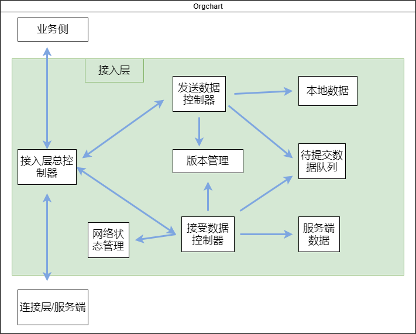

# 在线文档之职责驱动设计
## 接入层职责划分
在给系统分层、分模块的时候，很多时候都会根据职责进行划分，比如：  
- 网络层：负责与服务端的数据提交、接收等处理
- 数据层：负责数据的处理
- 渲染层：负责界面的渲染

这是很粗略的划分，实际上关于网络层的数据如何更新到数据层，数据层的变更又如何通知给渲染层，这些模块之间是有很多依赖关系的。如果只做最简单的划分，而不把职责、协作方式等都定义清楚，很可能到后期就会变成 A 模块里直接调用 B 模块，B 模块里也直接调用 A、C、D 模块，或者是全局事件满天飞的情况。  
### 按职责拆分对象
发送数据的模块中，夹杂着补拉版本的工作，实际上里面还需要维护一个用于按需提交的数据队列；接受数据的模块中，也同样存在着与业务逻辑严重耦合的冲突处理和应用协同等工作。在这样的设计中，各个对象之间的职责并不清晰，也存在相互之间的耦合甚至大鱼吃小鱼的情况。  
根据 RDD，我们先来根据职责划分出可选的对象：  
- 提交数据队列管理器：负责业务侧提交数据的管理
- 网络状态管理器：负责整个网络层的网络状态管理
- 版本管理器：负责网络层的版本管理/按序升版
- 发送数据管理器：负责接收来自业务侧的数据
- 接受数据管理器：负责接收来自连接层（服务端）的数据

### 职责对象间的边界
如果我们只对系统进行职责划分，而不定义清楚对象之间的边界、协作方式，那么实际上我们并没有真正意义上地完成系统设计这件事。  
根据职责划分简单地画出了各个对象间的依赖关系：

   

各个对象间的依赖关系远比这复杂，因此我们无法很清晰地解耦出各个对象间的依赖关系。此外，不管是业务侧还是连接层（服务端），都跟内部的具体某个对象有直接的依赖关系，这意味着外部模块依赖了内部的具体实现，不符合封装的设计，违反了接口隔离原则和防止变异（protected variations）原则。  
为了解决这些情况，我们可以拆分出控制器来进行职责分配，以及使用纯虚构（pure fabrication）来让这些信息专家保持保持良好的耦合和内聚。

### 拆分出控制器
在上述的职责对象划分中，有两个管理器的职责并没有很明确：发送数据管理器和接受数据管理器。实际上，它们扮演的角色应该更倾向于控制器：  
- 发送数据控制器：负责接收来自业务侧的数据，并提交到连接层（服务端）
- 接受数据控制器：负责接收来自连接层（服务端）的数据，并最终应用到业务侧

为了达到真正的控制器职责，发送数据控制器不仅需要将数据提交到连接层（服务端），也需要关注最终提交成功还是失败；接受数据控制器不仅需要接收来自连接层（服务端）的数据，还需要根据数据的具体内容，确保将数据正确地传递给业务侧。
与业务侧和连接层（服务端）的依赖关系，都转接到发送数据控制器和接受数据控制器中：  

   

这样也依然存在外层对象依赖具体的实现的情况，我们可以添加个总控制器，来专门对接业务侧和连接层（服务端）： 

   

来自业务侧的提交数据，总控制器会交给发送数据控制器进行处理，包括添加到待提交数据队列、提交成功/失败的处理等；来自服务端的消息，总控制器则会交给接受数据控制器进行处理，包括版本相关的数据进行冲突处理、更新版本等等，最终也会通过总控制器同步给业务侧。  
通过控制器的加入，各个职责对象（信息专家）之间不再存在直接的依赖关系，相互之间的联系都是通过控制器来进行管理的，这样它们就可以保持单一的职责关系，也可以专注于与控制器的协作方式  

### 使用纯虚构
纯虚构模式是为了保持良好的耦合和内聚，捏造业务上不存在的对象来承担职责。在上面我们添加了总控制器，也有用到了纯虚构。
在这里不管是本地数据提交完毕，还是服务端新数据的推送，发送数据控制器和接受数据控制器都会对版本管理进行更新。但实际上版本需要按序升版，因此当双方同时进行操作时，可能会导致版本错乱的问题，也可能造成版本丢失。  
为了解决这个问题，我们可以构造一个版本管理的任务队列，所有和版本相关的更新都放到队列里进行处理：  
任务队列每次只运行一个任务，任务在更新版本的时候确保了在原版本上按序升版。这样，不管是发送数据成功后的版本更新，还是接受到新的数据需要进行版本更新，都可以通过生成相关任务并添加到任务队列的方式，来进行版本升级。至于不同类型的任务，可以使用多态的方式来进行抽象和设计。
每个对象的职责我们已经可确认了：  
- 待提交数据队列管理器：负责维护业务侧提交的数据
- 网络状态管理器：负责维护整个网络层的网络状态
- 版本管理器：负责网络层的版本维护
- 任务队列管理器：负责按序升版相关的任务管理和执行
- 发送数据控制器：负责处理来自业务侧的数据，并保证数据顺序递交、按序升版
- 接受数据控制器：负责处理来自连接层（服务端）的数据，并保证数据完成冲突处理和应用
- 总控制器：负责接收来自业务侧和连接层（服务端）的数据，并分发给发送数据控制器和接受数据控制器

参考:  
[在线文档的网络层开发思考--职责驱动设计](https://godbasin.github.io/front-end-playground/front-end-basic/deep-learning/network-design-responsibility-driven-design.html#%E6%8E%A5%E5%85%A5%E5%B1%82%E8%AE%BE%E8%AE%A1)
