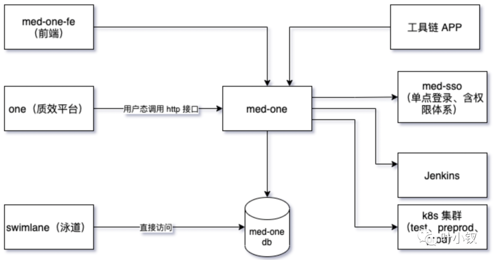
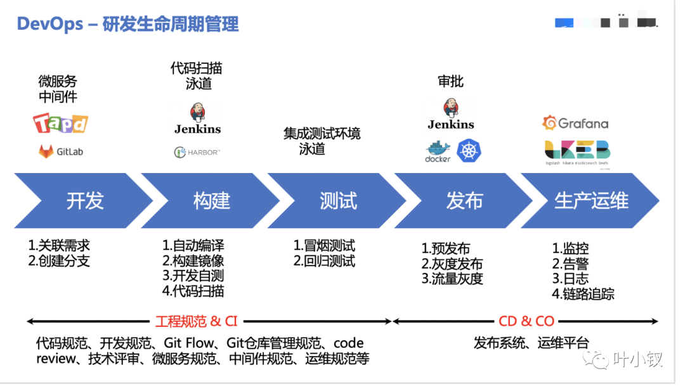
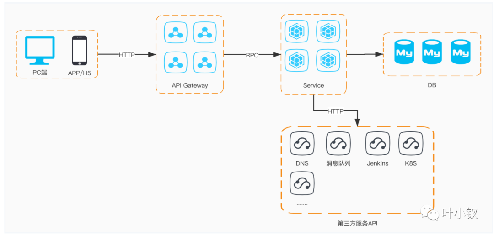

# 工程化建设中的发布系统
## 背景及意义
代码开发结束后，怎么发布到线上呢？一波来说是：
1. 开发团队在开发环境中完成软件开发，单元测试，测试通过，提交到代码版本管理库
2. 运维团队把应用部署到测试环境，供QA团队测试，测试通过后部署生产环境
3. QA团队进行测试，测试通过后通知部署人员发布到生产环境

但这个过程中可能出现问题：
1. 错误发现不及时 -- 很多错误在项目的早期可能就存在，到最后集成的时候才发现问题。
2. 人工低级错误发生 -- 产品和服务交付中的关键活动全都需要手动操作。
3. 团队工作效率低 -- 需要等待他人的工作完成后才能进行自己的工作
4. 开发运维对立 -- 开发人员想要快速更新，运维人员追求稳定，各自的针对的方向不同。

关键词CICD就出现了：持续集成与持续交付  
软件开发的连续方法基于自动执行脚本，以最大程度地减少在开发应用程序时引入错误的机会。从开发新代码到部署新代码，几乎不需要人工干预，甚至根本不需要干预。  
它涉及到在每次小的迭代中就不断地构建，测试和部署代码更改，从而减少了基于错误或失败的先前版本开发新代码的机会。  
定制化的CICD平台，包含项目发布平台（med-one）、泳道平台（swimlane）  

## 项目发布平台
项目发布平台是整个CICD的核心，其中包含了：创建应用->创建环境->创建配置文件->构建镜像->提交变更-->发布应用 等功能：  

组件说明:  
1. API Gateway：路由、认证、鉴权、会话保持、协议转换
2. Service：业务逻辑层+数据访问层
3. 第三方服务API：K8S系统、Jenkins、腾讯云产品API等

### 功能详情
**应用创建**  
应用创建本身是一个注册的过程并不关联其他资源甚至是K8S集群资源,创建好后该应用会生成唯一ID。  
应用状态分为：审核中->待上线->已上线->待下线→已下线 ，代表一个应用的整个生命周期  
已上线定义为：已在线上提供服务，通过发布平台第一次发布成功后自动更新状态为已上线
应用分为：注册和上线两个阶段，注册仅仅是拿到一个应用名称  
应用支持的操作：镜像构建、新建变更、发布、添加环境、扩缩容、重启、更多 应用一级分类：  
- 自研应用：自主开发的应用或者基于开源软件进行二次开发的软件
- 商业应用：外购、免费、开源应用需要部署并提供服务的，例如：Grafana、Jaeger、Gitlab、Confluence等
- 空应用：不走发布流程不申请仓库，仅做申请资源使用
- 核心应用：涉及交易、资金以及核心业务中关键链路必须存在的应用、被依赖的中间件、运维工具
- 非核心应用：不属于核心应用但涉及业务服务的应用
- 边缘应用：内部小范围使用的工具或产品、短时间内无法下线的僵尸应用、出现问题并不引发故障

应用注册只提供简要信息，注册申请通过后需要补充详细信息。详细信息补充完成后才可以进行发布  
_环境管理_
部署在不同环境中对资源的描述，它是包括环境和资源的总和。创建一个环境意味着应用和一个环境以及定义的资源做了关联。在发布的时候可以选择。【环境类型】+【集群】的组合只能有一个。  
基于镜像的发布模式，创建环境后会去K8S集群中创建对象，由于镜像可能未必会有，所以容器会处于ERROR状态。  
需要增加一个就是Service创建，界面类似，提供可以创建多个Service. 如果不写则默认会创建一个ClusterIP类型的Service，端口则根据端口映射设置来配置。  
可以查看环境详情，也可以查看该环境实例列表。在实例列表页面可以操作扩容和缩容。容量范围区间1-24。扩缩容操作提交后会自动创建变更单和自动创建发布变更并使两者关联。  
环境支持的操作：详情、部署配置、实例列表  
详情显示环境信息，这里可以修改环境信息。保存环境信息后会进行提示它会去进行replace也就是容器会被更新。如果点击确认后，则自动生成变更单自动提交发布生成发布记录。更新进度去实例列表中查看。  
用户中心（med-xuser） 有两个环境 prod（正式环境）、test（测试环境）  
_配置管理_  
支持consul和apollo来做配置后端，consul 简化了分布式环境中的服务的注册和发现流程，通过 HTTP 或者 DNS 接口发现。支持外部 SaaS 提供者等。  
apollo（阿波罗）是携程框架部门研发的开源配置管理中心，能够集中化管理应用不同环境、不同集群的配置，配置修改后能够实时推送到应用端，并且具备规范的权限、流程治理等特性。apollo支持4个维度管理Key-Value格式的配置：application (应用)、environment (环境)、cluster (集群)、namespace (命名空间)  
_镜像构建_  
镜像构建，构建镜像的时候会选择环境，虽然我们的镜像本身不依赖环境信息，但是我们要做区分。构建镜像的时候选择环境、由于代码仓库已知，所以只需要填写必要分支，自定义版本标记和备注说明  
自定义版本标记：这个版本标记只是标识该版本和基于某个commit构建的镜像，便于识别。  
这里用到jenkins来做镜像构建。  
构建完成后会填充镜像完整地址到本次构建的记录上。同时查看详情时还会显示该镜像的HASH值等信息。删除一个构建记录则对应仓库中的镜像也会被删除。  
_发布变更_  
发布是基于一个确定的变更来完成。目前依然采取一次性发布，发布失败可以进行回滚。暂时不采取分阶段发布模式。  
基线：环境资源配置、程序运行时配置、代码版本其实都是基线范畴，先做到对基线的定义为代码和环境资源，未来会把运行时配置也纳入进来。所以每次发布都要获取当前基线，然后进行发布，发布后需要重新写基线，每一个基线有自己的版本，每个基线版本对应一套配置（广义上的配置，而非程序配置文件）。回滚时我们会做基线对比进行基线层面的回滚。  
变更不只是代码的变更也包括实例副本数量的变更、环境资源的变更。创建好的变更可以被修改和关闭，关闭变更意味着作废且不能被发布引用，但是一个已经发布的变更将被留作存档进行保存。创建之后会产生ID和默认状态。一个变更只能被发布一次  
变更的状态包括：  
1. 开发中：新建之后的默认状态，表示该变更还没有提交发布。状态为 开发中 的变更单可以修改。
2. 审批中：TL审批，同意后状态变为待发布。驳回后状态变为开发中
3. 已关闭：创建后人工关闭
4. 待发布：不需要审批的应用创建后可以直接提交到发布列表中等待发布；需要审批的提交待发布后会进入 审批中 审批通过后变为 待发布
5. 已发布：完成发布
6. 发布中：当执行发布后发布单的状态会同步到变更单中
7. 失败：具体原因具体分析
8. 操作：提交待发布，点击后该变更由开发中变为待发布；提交审批；关闭变更，开发中 状态的可以进行关闭

变更本身也有多种类型，代码变更需要人工提交变更单，扩容缩容变更以及环境资源变更系统会自动创建对应类型的变更单且立即执行，然后可以去发布中查看状态。重启操作不会创建变更，只会记录操作记录。  

_发布_  
发布主要是去执行变更设定的任务，可以视为任务执行状态查看。  
待发布：该发布尚未运行，该状态的变更必须进行退回到开发中才可关闭或者修改。  
灰度：发了部分pod  
失败：发布中的某些步骤失败或者POD中的容器启动失败  
已完成：发布任务已经完成，执行发布的任何步骤都没有失败且POD中的容器为运行状态  
发布中：发布任务正在执行  
注意：提交发布后会开始执行发布任务，发布任务执行前会记录当前应用所用的镜像ID是什么  
支持的操作为：详情，查看变更基本信息、回滚、跳转到实例列表查看实例状态。回滚可以回滚多次，回滚时要关联一个发布单，同时要选择镜像，该镜像默认为该发布单记录的该次发布前容器所用镜像，当然也可以选择其他的。回滚后会添加一条操作记录。同时该发布单对应的变更单也记录一次回滚操作。  
发布时支持灰度发布，灰度发布用于生产环境发布，相对于全量发布或者k8s滚动发布特性，灰度发布要求按pod的比例发布新版本应用，提供回退以及扩容的功能。详细参照：k8s官方发布策略  
k8s灰度发布的步骤：  
1. 版本1有10个副本
2. 灰度部署版本2的一个副本
3. 等待版本2稳定
4. 扩容版本2到n个副本，并且降低版本1到n个副本
5. 等待所有版本稳定
6. 关停版本1

**泳道平台（swimlane）**  
同时存在几十个需求迭代同时开发，且不同的迭代可能会修改同一个项目，代码的冲突可以通过不同的分支解决，但开发阶段的联调都在同一个开发环境上的话会存在相互影响，造成开发效率低。  
许多迭代的代码在同一个开发环境上联调会造成许多问题，研发人员解决这些问题开销的时间和精力成本很大。  
这样的环境管理时间一久便造成了开发环境的联调不太稳定，研发人员转而将开发阶段的联调放到了测试环境，从而污染了测试环境，进而影响了测试阶段的效率。我们期望保证研发同学能够在不同的迭代情况下能够独立开发联调，测试同学期望保证测试环境的稳定。  
"泳道"，顾名思义是可以让不同的迭代开发能够在其自己的"泳道"上玩，不会影响其他的"泳道"。  
泳道环境实现了自动化的环境创建和销毁功能，自动化对接了多个相关的CI/CD组件，包括：Gitlab、Jenkins、K8S、Nginx-Ingress、ConfigCentre、DNSServer。各个组件能够协调工作的前提，是需要满足一定的前置约定，以便实现泳道环境正常运行、降低维护成本。  
泳道与应用概念  
1. 一个泳道环境可能是一次迭代，或者独立的一个开发测试的隔离环境
2. 一个泳道环境对应唯一的一个泳道项目，一个泳道项目可以包含多个应用
3. 应用的基本信息是唯一的，但是在不同的泳道环境中，应用的访问地址将会不同
4. 各个泳道之间使用K8S Namespace进行资源隔离
5. 泳道的名称作为对接各个系统组件的唯一标识

项目分支名称  
项目分支名称统一为 feature/泳道名称 ，项目分支由平台自动化创建。如果该分支已经在仓库中存在，那么平台不会对分支做任何修改  
Jenkins Job名称  
泳道系统将会自动在Jenkins系统上创建对应 泳道名称 的目录，在其下自动创建对应的应用名称的 Job，由开发者自行点击该Job部署应用到泳道环境  
内部及外部访问域名  
DevOps平台在创建泳道环境时将会根据给定的应用自动识别其内部访问域名及对外的访问域名  
内部域名规则：应用Service名称.泳道名称，例如：med-d2d.swimlane, med3-svr.swimlane  
外部域名规则：业务域名-泳道名称.medlinker.com，例如：web-swimlane.medlinker.com, app-swimlane.medlinker.com  
其中，外部域名将会自动创建到DNSServer上，泳道销毁时将会自动删除DNS解析。  
K8S命名空间  
K8S的命名空间将会直接使用泳道名称，需要注意的是，K8S命名空间仅支持字母、数字、'-'符号，因此泳道名称中的特殊字符将会被自动转换为'-'符号。  
**泳道特性**  
环境资源隔离。每个泳道的资源是相互隔离的。  
自动创建项目分支。每个泳道下面的应用会按照既定的规则自动创建分支。  
自动创建配置文件分支  
consul：每个泳道通过配置管理仓库不同的分支来管理，配置仓库分支同代码分支名，基于创建泳道时的master分支（集成测试环境配置）创建  
Apollo：每个泳道通过使用不同cluster（集群）来管理，集群名字同代码代码分支名，基于创建泳道时的default集群（集成测试环境配置）创建  
自动创建独立的外网访问域名  
如果是涉及到外网访问的服务，泳道会按照既定的规则自动创建独立的外网访问域名。  
会将对应集成测试环境配置中包含-qa（约定集成测试环境的域名均为***-qa.medlinker.com）替换为-泳道名字，k8s内部域名***.app 也会被替换为对应***.泳道名字  
自动创建独立的Jenkins Jobs  
泳道的构建+发布由Jenkins负责一条龙服务，每个泳道在创建时也会自动创建独立的Jenkins构建目录，分开管理互不影响。  
仓库推送代码，泳道自动构建  
当创建泳道时会自动在业务项目上创建WebHook，当开发者往业务项目仓库push分支时，会自动触发泳道对应的项目Jenkins自动构建+部署，方便开发者，提高开发阶段效率。  
**使用**  
环境的创建只需要输入、选择信息  
泳道和tapd的工单是强关联的，每一个泳道都应该对应到一个需求，泳道描述会自动取tapd的标题  
泳道环境的信息在修改时不能修改名称，但是其他信息可修改，当应用没有变化时只会更新基础信息，否则平台会自动识别应用变化，删除不再需要的应用，部署新增加的应用。  
环境的删除有二次确认，删除操作是同步的（删除不成功可以重复执行），大概需要10-30秒的时间，将会自动删除以下信息：动态域名、K8S部署内容、Jenkins Job、Nginx-Ingress相关配置  
**泳道消息染色**  
泳道消息染色，为的是提供一种策略，可以让泳道生产、以及消费消息时，不和QA环境竞争。当然，你也可以再泳道生产消息，让QA消费，这个是默认策略。而泳道提供了（2021年11日18日后），可以泳道生产，泳道消费的策略。  
例如把med-xuer, med-xim-job, passport-interface 三个应用，需要对 med-xuer 的 med-ltv-message 消息消费的逻辑做研发。  
首先我们确定发消息是：med-xuer 服务，那我么需要对他发出的消息进行染色（这里，我们把它加入到表单即可，容器会给他一个打个特殊的 ENV 变量）。  
而消费消息的服务是：med-xuser-job， 把这个topic对应的group加入到染色消费组表单中。这样泳道会为你创建一个泳道消费组，和QA消费组区分。  
泳道自动删除  
由于的泳道资源有限，部分泳道在使用后没有及时的删除，造成资源的浪费。目前设计是：6天后（具体时间可配置）未操作过的泳道会进入待删除列表，并通知到钉钉群，如果没有续期将会在第7天删除  

原文:  
[聊聊工程化建设中的发布系统](https://mp.weixin.qq.com/s/k28Yed8oq5SQTtyTddYTJg)
