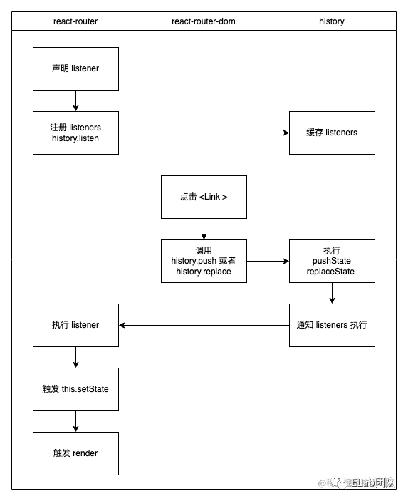

# MDN 里暂时还查不到的 Navigation API
## SPA & History API
而在前端常见的业务场景，单页应用即 SPA 中，路由守卫功能则显得至为重要。目前主流的在 SPA 中实现路由守卫功能的方法，则是借助 History API 来实现的。基本原理是借助 window.history.pushState 以及 window.history.replaceState 来随时改变页面地址导航，再借助 window.onpopstate 或者 window.onhashchange 来监听页面的导航地址变化。  

## 无法感知的 pushState & replaceState
History API 也不是完全的银弹，主要在于导航地址监听器，只能监听到页面的前进后退，无法监听到 pushState 跟 replaceState。但是，一般页面上都会存在一些交互，会需要随时调用 pushState 或者 replaceState 来改变页面导航，与此同时，也需要相应地触发页面内的相关部分渲染更新。  
为了解决这个无法感知的问题，通常有以下两种解决方案  
**解决方案一**  
先注册自定义的 listeners，再给 push 跟 replace 再包一层，封装出来另外独立的 push 跟 replace 方法，之后每次调用的都是封装之后的方法，该方法内部会先真正执行 pushState 以及 replaceState 方法，之后再通知前面注册的 listeners 去执行  
使用这种解决方案的典型例子是 react-router，具体流程如下图  



但是这种方案其实也是有局限性的，因为他依赖于其他模块都向同一个地方注册 listeners 并要求其他模块都去使用它自定义的封装过后的 push 跟 replace，其并没有提供一种通用规范的中心化的解决方案。假如现在页面中引入了另一部分会更新页面地址导航的逻辑，但是其并不使用前者封装的 push 或者 replace 的话，那么还是没办法触发页面渲染更新。  

**解决方案二**  
通过直接暴力重写 window.history.pushState 跟 window.history.replaceState 方法，提供通用中心化解决方案。类似如下  
``` 
const rewrite = function(type) {
  const hapi = history[type];
  return function() {
    // 可以在此处自定义更多的其他逻辑
    // ...
    const res = hapi.apply(this, arguments);
    // ...
    // 自定义抛出一个 popstate 事件，让其他部分监听 popstate 事件的代码，也能感知到
    const eventArguments = createPopStateEvent(window.history.state, type);
    window.dispatchEvent(eventArguments);
    return res;
  }
};

history.pushState = rewrite("pushState");
history.replaceState = rewrite("replaceState");
```
使用这种解决方案的典型例子是 Garfish，但是这种解决方案，也是有副作用的，毕竟暴力重写了全局方法，同时还自定义抛出了一个 popstate 事件。  
假如当前页面除了有 Garfish 之外，还有另外一个模块，该模块自己内部定义了一个经过封装的 push 方法，其每次调用该 push 方法时，会先调用经过 rewrite 的 window.history.pushState 并触发一次 popstate 事件，之后又会再通知模块内部的 listener 执行，与此同时，该模块内部也监听到了 popstate 事件并再一次执行了一次 listener，这时候，我们就会发现重复执行了两次 listener，这便是一个典型的副作用。  

## Navigation API 横空出世
Navigation API 定位是现代前端原生路由。同时也重点声明了可以用 Navigation API 重新构建 SPA 的。  
**NavigateEvent**  
Navigation API 里比较核心重要的部分，就是 navigate event 了。使用示例如下：  
``` 
navigation.addEventListener('navigate', navigateEvent => {
  switch (navigateEvent.destination.url) {
    case 'https://example.com/':
      navigateEvent.transitionWhile(loadIndexPage());
      break;
    case 'https://example.com/cats':
      navigateEvent.transitionWhile(loadCatsPage());
      break;
  }
});
```
_为什么需要增加一个 NavigateEvent_  
在结合 History API 实现 SPA 的时候，为了能感知到 pushState 以及 replaceState，我们是需要通过做很多其他的工作才能做到的，但是，有了 navigate event 之后，我们就可以轻轻松松通过添加一个事件监听器，就能监听到绝大部分的地址导航变化。现在我们再一次执行 pushState 以及 replaceState 的时候，是可以被 navigate 事件的监听器监听并感知到的。  

**Transition**  
Transition 顾名思义，就是可以在页面发生 navigate event 时，做一些自定义的过渡的操作。其中主要是使用 transitionWhile()，他接受一个 Promise 类型参数，使用方式是，在 navigate 事件监听器内执行，他的执行，代表着告诉浏览器目前正在准备新的状态新的页面，这是需要耗费一定时间的，至于具体耗费多长时间，取决于传入的 Promise 何时 resolved 或者 rejected。  
``` 
navigation.addEventListener('navigate', navigateEvent => {
  if (isCatsUrl(navigateEvent.destination.url)) {
    const processNavigation = async () => {
      const request = await fetch('/cat-memes.json',);
      const json = await request.json();
      // TODO: do something with cat memes json
    };
    navigateEvent.transitionWhile(processNavigation());
  } else {
    // load some other page
  }
});
```
**Transition Success and Failure**  
传入 transitionWhile() 的 Promise 参数，是有可能成功 resolved 也有可能失败 rejected 的，而这两种状态，分别对应着 Transition Success 以及 Transition Failure，继而也对应着 navigatesuccess 以及 navigateerror 两个事件。  
当 Promise 达到 fulfills 时，或者是压根就没有调用 transitionWhile()，那么 Navigation API 将会触发一个 navigatesuccess 事件。  
``` 
navigation.addEventListener('navigatesuccess', event => {
  loadingIndicator.hidden = true;
});  
```
当 Promise rejects 时，Navigation API 则会触发一个 navigateerror 事件  
``` 
navigation.addEventListener('navigateerror', event => {
  loadingIndicator.hidden = true; // also hide indicator
  showMessage(`Failed to load page: ${event.message}`);
});
```
**导航取消 Abort Signals**  
假如当前页面还正在导航跳转时，突然被强占了，比如用户这时突然又点击了另外一个链接进行访问或者代码里直接执行了另外一个导航，为了应对这种情况，我们在传送给 navigate 的事件监听器的 event 参数对象里，多增加了一个 property 即 signal，类型为 window.AbortSignal。可以结合 AbortSignal 及 fetch 来实现 Abortable fetch，方法是，将 AbortSignal 传给 fetch，如果当前导航跳转被抢占了，则可以立即取消掉相应的网络请求，这样既可以节省用户的带宽，又可以将 fetch 返回的 Promise 置为 rejected 的状态，以防止任何无效的代码更新页面导致出现无效非法的导航页面。  
``` 
navigation.addEventListener('navigate', navigateEvent => {
  if (isCatsUrl(navigateEvent.destination.url)) {
    const processNavigation = async () => {
      const request = await fetch('/cat-memes.json', {
        signal: navigateEvent.signal,
      });
      const json = await request.json();
      // TODO: do something with cat memes json
    };
    navigateEvent.transitionWhile(processNavigation());
  } else {
    // load some other page
  }
});
```
## Entries
Navigation API 也有 Entries 概念，代表的是导航页面入口。可以通过 navigation.currentEntry 获取到当前用户所在的导航页面入口，也可以通过 navigation.entries() 获取到用户导航访问过的所有入口的列表。其中，Entry 在 Web IDL 中的规范定义如下  
``` 
interface NavigationHistoryEntry : EventTarget {
  readonly attribute USVString? url;
  readonly attribute DOMString key;
  readonly attribute DOMString id;
  readonly attribute long long index;
  readonly attribute boolean sameDocument;

  any getState();

  attribute EventHandler ondispose;
};
```
- url：导航会话的 URL 地址
- key：在导航会话历史栈中的唯一标识，id 与 key 的区别在于，key 标识是在栈中的唯一标识，id 是 NavigationHistoryEntry 实例的唯一标识。例如：调用 replace 或 reload 时并没有产生新的导航会话，但会生成新的 NavigationHistoryEntry，前后两个 NavigationHistoryEntry 实例的 key 相同，但 id 不同。
- id：导航会话的唯一标识
- index：指示该导航会话在历史栈的位置，默认从 0 开始
- sameDocument：true 代表当前是处于激活状态，false 则表示未激活
- getState：返回导航会话存储的状态，类似 history.state
- ondispose：监听 dispose 事件，在该导航会话从历史栈中删除时触发

可以通过 getState() 来获取 Entries 的 State，例如 navigation.currentEntry.getState()，这里的 State 也可以通过 navigation.updateCurrentEntry({state: something}); 来更新。  

## 导航操作
- navigation.navigate(url: string, options:state: any, history: 'auto' | 'push' | 'replace')  
  打开目标地址页面，相等于 history.pushState 和 history.replaceState，但是支持跨域地址
- navigation.reload({ state: any })
  刷新当前页面，相当于调用了 location.reload()
- navigation.back()
  在导航会话历史中向后移动一页，相当于 history.back()  
- navigation.forward()
  在导航会话历史中向前移动一页，相当于 history.forward()
- navigation.traverseTo(key: string)
  在导航会话历史记录中加载特定页面，相当于 history.go()，但区别在于传参不同，navigation 给每个导航会话设置了一个唯一标识，traverseTo 接受的参数正是该唯一标识，即 NavigationHistoryEntry.key

## 不足
新 API，兼容性不好，Navigation API 是从 Chrome 102 才开始支持的

原文:  
[MDN 里暂时还查不到的 Navigation API](https://mp.weixin.qq.com/s/e5m16V5PCrzhwOxVBMNr1w)
