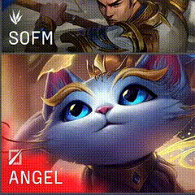

# LPL Ban/Pick 选人阶段的遮罩效果是如何实现的
LPL比赛的过程中的 Ban/Pick 选人阶段，出现了一种新的，有意思的遮罩效果，如下图所示：

  

## 实现烟雾化遮罩效果
假设没有模糊的边缘，及烟雾化的效果，它其实就是一个渐变：
``` 
// html
<div></div>

// CSS
div {
    width: 340px;
    height: 180px;
    border: 2px solid #5b595b;
    background: linear-gradient(
        rgba(229, 23, 49, 1),
        rgba(229, 23, 49, .9) 48%,
        transparent 55%,
    );
}
```
使用 SVG 的 <feturbulence> 滤镜得到一个雾化效果,<feturbulence>  的 type="fractalNoise" 在模拟云雾效果时非常好用。该滤镜利用 Perlin 噪声函数创建了一个图像，能够实现半透明的烟熏或波状图像，用于实现一些特殊的纹理。  
利用 <feturbulence> 滤镜简单处理一下上述图形：  
``` 
<div></div>

<svg width="0">
  <filter id="filter">
    <feTurbulence id="turbulence" type="fractalNoise" baseFrequency=".03" numOctaves="20" />
    <feDisplacementMap in="SourceGraphic" scale="30" />
  </filter>
</svg>
```
利用 filter: url() 对对应的元素引入该滤镜：  
``` 
div {
    ...
    filter: url(#smoke);
}
```
由于给元素加了边框，整个边框也被雾化了，可以使用伪元素改造一下，边框作用于容器，使用伪元素实现渐变，将滤镜作用于伪元素：  
``` 
div {
    position: relative;
    width: 340px;
    height: 180px;
    border: 2px solid #5b595b;
    
    &::before {
        content: "";
        position: absolute;
        left: 0;
        top: 0;
        right: 0;
        bottom: 0;
        background: linear-gradient(
            30deg,
            rgba(229, 23, 49, 1),
            rgba(229, 23, 49, .9) 48%,
            transparent 55%,
        );
        filter: url(#smoke);
    }
}
```
改变一下定位的 top \ left \ right \ bottom，让伪元素超出父容器，父容器设置 overflow: hidden：  
``` 
div {
    ....
    overflow: hidden;
    
    &::before {
        ....
        left: -20px;
        top: -10px;
        right: -20px;
        bottom: -20px;
        background: linear-gradient(
            30deg,
            rgba(229, 23, 49, 1),
            rgba(229, 23, 49, .9) 48%,
            transparent 55%,
        );
        filter: url(#smoke);
    }
}
```
使用JavaScript，控制动画的整体循环。
``` 
const filter = document.querySelector("#turbulence");
let frames = 1;
let rad = Math.PI / 180;
let bfx, bfy;

function freqAnimation() {
    frames += .35;

    bfx = 0.035;
    bfy = 0.015;

    bfx += 0.006 * Math.cos(frames * rad);
    bfy += 0.004 * Math.sin(frames * rad);

    bf = bfx.toString() + " " + bfy.toString();
    filter.setAttributeNS(null, "baseFrequency", bf);

    window.requestAnimationFrame(freqAnimation);
}

window.requestAnimationFrame(freqAnimation);
```
这段代码做的就是让SVG的 #turbulence 滤镜的 baseFrequency 属性，在一个区间内无限循环。通过改变 baseFrequency，让整个烟雾不断变化。  
**实现呼吸状态的遮罩效果**  
``` 
@property --per {
    syntax: "<percentage>";
    inherits: false;
    initial-value: 22%;
}
div::before {
    ...
    background: linear-gradient(
        30deg,
        #ff0020,
        rgba(229, 23, 49, .9) var(--per),
        transparent calc(var(--per) + 8%),
    );
    filter: url(#smoke);
    animation: change 2s infinite ease-out;
}
@keyframes change {
    50% {
        --per: 18%;
    }
}
```

参考:  
[LPL Ban/Pick 选人阶段的遮罩效果是如何实现的？](https://mp.weixin.qq.com/s/ADw-MOrRco2bxGgOraFGzw)
