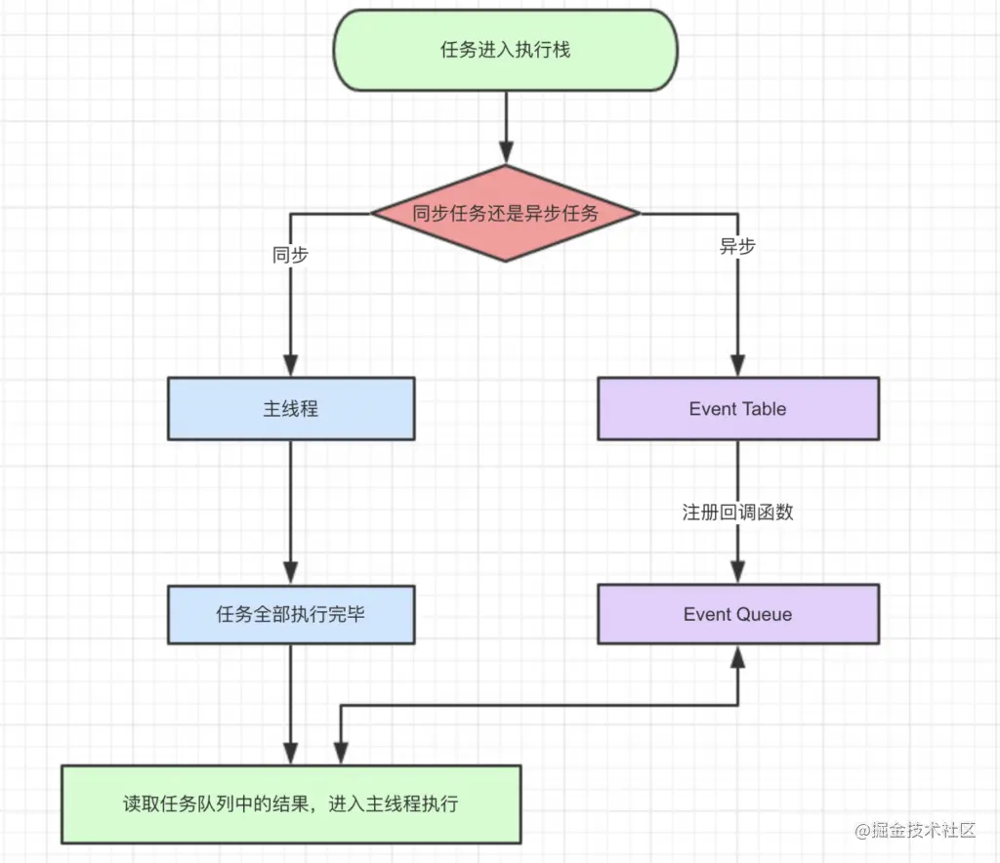

# JS事件循环机制之宏任务，微任务
**JS事件循环**  
js任务要一个一个顺序执行。如果一个任务耗时过长，那么后一个任务也必须等着。任务分为同步任务和异步任务。  
一个方法执行会向执行栈中加入这个方法的执行环境，在这个执行环境中还可以调用其他方法，甚至是自己，其结果不过是在执行栈中再添加一个执行环境。这个过程可以是无限进行下去的，除非发生了栈溢出，即超过了所能使用内存的最大值。  
示例代码：  
```
console.log('script start');

setTimeout(function() {
  console.log('setTimeout');
}, 0);

Promise.resolve().then(function() {
  console.log('promise1');
}).then(function() {
  console.log('promise2');
});

console.log('script end');
```
打印顺序是：script start, script end, promise1, promise2, setTimeout

解读：  
- 同步和异步任务分别进入不同的执行"场所"，同步的进入主线程，异步的进入Event Table并注册函数
- 当指定的事情完成时，Event Table会将这个函数移入Event Queue。
- 主线程内的任务执行完毕为空，会去Event Queue读取对应的函数，进入主线程执行。
- 上述过程会不断重复，也就是常说的Event Loop(事件循环)。

怎么知道主线程执行栈为空呢？js引擎存在monitoring process进程，会持续不断的检查主线程执行栈是否为空，一旦为空，就会去Event Queue那里检查是否有等待被调用的函数。   
看代码：  
``` 
let data = [];
$.ajax({
    url:www.javascript.com,
    data:data,
    success:() => {
        console.log('发送成功!');
    }
})
console.log('代码执行结束');
```
- ajax进入Event Table，注册回调函数success。
- 执行console.log('代码执行结束')。
- ajax事件完成，回调函数success进入Event Queue。
- 主线程从Event Queue读取回调函数success并执行。

**微任务和宏任务皆为异步任务，它们都属于一个队列，主要区别在于他们的执行顺序，Event Loop的走向和取值。那么他们之间到底有什么区别呢？**  

> js异步有一个机制，就是遇到宏任务，先执行宏任务，将宏任务放入eventqueue，然后再执行微任务，将微任务放入eventqueue最骚的是，这两个queue不是一个queue。当你往外拿的时候先从微任务里拿这个回调函数，然后再从宏任务的queue上拿宏任务的回调函数。

- 宏任务一般是：包括整体代码script，setTimeout，setInterval、setImmediate。
- 微任务：原生Promise(有些实现的promise将then方法放到了宏任务中)、process.nextTick、Object.observe(已废弃)、 MutationObserver

**setTimeout**  
setTimeout在我们设定的延迟时间后执行，但有时会出现比我们所设定延迟的时间还长才执行，因为setTimeout是异步的，所以先执行同步代码，但如果同步代码所需要的时间大于异步代码，那就会出现延迟执行的情况  
例如：  
``` 
setTimeout(() => {
    task()
},3000)

sleep(10000000)
```
- task()进入Event Table并注册,计时开始。
- 执行sleep函数，很慢，非常慢，计时仍在继续。
- 3秒到了，计时事件timeout完成，task()进入Event Queue，但是sleep也太慢了吧，还没执行完，只好等着。
- sleep终于执行完了，task()终于从Event Queue进入了主线程执行。

setTimeout(fn,0)这样的代码是不是可以立即执行呢？答案是不会的，setTimeout(fn,0)的含义是，指定某个任务在主线程最早可得的空闲时间执行，意思就是不用再等多少秒了，只要主线程执行栈内的同步任务全部执行完成，栈为空就马上执行。举例说明：  
``` 
//代码1
console.log('先执行这里');
setTimeout(() => {
    console.log('执行啦')
},0);

//代码2
console.log('先执行这里');
setTimeout(() => {
    console.log('执行啦')
},3000);
```
代码1的输出结果是：  
```  
先执行这里
执行啦
```
代码2的输出结果是：
``` 
//先执行这里
// ... 3s later
// 执行啦
```
setTimeout要补充的是，即便主线程为空，0毫秒实际上也是达不到的。根据HTML的标准，最低是4毫秒。  
**setInterval**  
对于执行顺序来说，setInterval会每隔指定的时间将注册的函数置入Event Queue，如果前面的任务耗时太久，那么同样需要等待。需要注意的一点是，对于setInterval(fn,ms)来说，我们已经知道不是每过ms秒会执行一次fn，而是每过ms秒，会有fn进入Event Queue。一旦setInterval的回调函数fn执行时间超过了延迟时间ms，那么就完全看不出来有时间间隔了。  
process.nextTick(callback)类似node.js版的"setTimeout"，在事件循环的下一次循环中调用 callback 回调函数。  
**不同类型的任务会进入对应的Event Queue，比如setTimeout和setInterval会进入相同的Event Queue。**  
例如：  
``` 
setTimeout(()=>{
  console.log('setTimeout1')
},0)
let p = new Promise((resolve,reject)=>{
  console.log('Promise1')
  resolve()
})
p.then(()=>{
  console.log('Promise2')    
})
```
Promise参数中的Promise1是同步执行的 其次是因为Promise是microtasks，会在同步任务执行完后会去清空microtasks queues， 最后清空完微任务再去宏任务队列取值。  
``` 
Promise.resolve().then(()=>{
  console.log('Promise1')  
  setTimeout(()=>{
    console.log('setTimeout2')
  },0)
})

setTimeout(()=>{
  console.log('setTimeout1')
  Promise.resolve().then(()=>{
    console.log('Promise2')    
  })
},0)
```
输出结果是Promise1，setTimeout1，Promise2，setTimeout2  
- 一开始执行栈的同步任务执行完毕，会去 microtasks queues 找清空 microtasks queues，输出Promise1，同时会生成一个异步任务 setTimeout1
- 去宏任务队列查看此时队列是 setTimeout1 在 setTimeout2 之前，因为setTimeout1执行栈一开始的时候就开始异步执行,所以输出 setTimeout1
- 在执行setTimeout1时会生成Promise2的一个 microtasks ，放入 microtasks queues 中，接着又是一个循环，去清空microtasks queues ，输出 Promise2
- 清空完 microtasks queues ，就又会去宏任务队列取一个，这回取的是 setTimeout2

``` 
console.log('1');

setTimeout(function() {
    console.log('2');
    process.nextTick(function() {
        console.log('3');
    })
    new Promise(function(resolve) {
        console.log('4');
        resolve();
    }).then(function() {
        console.log('5')
    })
})
process.nextTick(function() {
    console.log('6');
})
new Promise(function(resolve) {
    console.log('7');
    resolve();
}).then(function() {
    console.log('8')
})

setTimeout(function() {
    console.log('9');
    process.nextTick(function() {
        console.log('10');
    })
    new Promise(function(resolve) {
        console.log('11');
        resolve();
    }).then(function() {
        console.log('12')
    })
})
```
事件循环流程分析：  
- 整体script作为第一个宏任务进入主线程，遇到console.log，输出1。
- 遇到setTimeout，其回调函数被分发到宏任务Event Queue中。我们暂且记为setTimeout1。
- 遇到process.nextTick()，其回调函数被分发到微任务Event Queue中。我们记为process1。
- 遇到Promise，new Promise直接执行，输出7。then被分发到微任务Event Queue中。我们记为then1。
- 又遇到了setTimeout，其回调函数被分发到宏任务Event Queue中，我们记为setTimeout2。
- 第一轮事件循环宏任务结束时各Event Queue的情况，此时已经输出了1和7。

发现了process1和then1两个微任务。
- 执行process1,输出6。
- 执行then1，输出8。

第一轮事件循环正式结束，这一轮的结果是输出1，7，6，8。  
第二轮时间循环从setTimeout1宏任务开始：  
- 首先输出2。接下来遇到了process.nextTick()，同样将其分发到微任务Event Queue中，记为process2。
- new Promise立即执行输出4，then也分发到微任务Event Queue中，记为then2

第三轮事件循环宏任务执行结束，执行两个微任务process3和then3  
- 输出10。
- 输出12。
- 第三轮事件循环结束，第三轮输出9，11，10，12。
- 整段代码，共进行了三次事件循环，完整的输出为1，7，6，8，2，4，3，5，9，11，10，12。(请注意，node环境下的事件监听依赖libuv与前端环境不完全相同，输出顺序可能会有误差)

参考: 
[JS事件循环机制（event loop）之宏任务/微任务](https://juejin.cn/post/6844903638238756878)