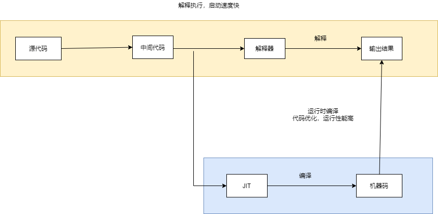

# V8编译浅谈
## 解释器和编译器
**解释器**  
解释器的作用是将某种语言编写的源程序作为输入，将该源程序执行的结果作为输出，例如 Perl、Scheme、APL 等都是使用解释器进行转换执行  
**编译器**  
编译器的设计需要解决两个相对重要的问题：
- 如何分析不同高级程序语言设计的源程序
- 如何将源程序的功能等价映射到不同指令系统的目标机器

**中间表示（IR）**  
中间表示（Intermediate Representation，IR）是程序结构的一种表现方式，它会比抽象语法树（Abstract Syntax Tree，AST）更加接近汇编语言或者指令集，同时也会保留源程序中的一些高级信息，具体作用包括：  
- 易于编译器的错误调试，容易识别是 IR 之前的前端还是之后的后端出的问题
- 可以使得编译器的职责更加分离，源程序的编译更多关注如何转换成 IR，而不是去适配不同的指令集
- IR 更加接近指令集，从而相对于源码可以更加节省内存空间

**优化编译器**  
IR 本身可以做到多趟迭代从而优化源程序，在每一趟迭代的过程中可以记录优化的细节，方便后续的迭代查找并利用这些优化信息，最终可以高效输出更优的目标程序  
优化器可以对 IR 进行一趟或者多趟处理，从而生成更快执行速度或者更小体积的目标程序（例如找到循环中不变的计算并对其进行优化从而减少运算次数），也可能用于产生更少异常或者更低功耗的目标程序。除此之外，前端和后端内部还可以细分为多个处理步骤  

**两者的特性比较**  

| 类型 | 解释器 | 编译器 |
| -----| ---- | ---- |
| 工作机制 | 编译和执行同时运行 | 编译和执行分离 |
| 启动速度 | 相对较快 | 相对较慢 |
| 运行性能 | 相对较低 | 相对较高 |
| 错误检测	 | 运行时检测 | 编译时检测 |

早期的 Web 前端要求页面的启动速度快，因此采用解释执行的方式，但是页面在运行的过程中性能相对较低。为了解决这个问题，需要在运行时对 JavaScript 代码进行优化，因此在 JavaScript 的解析引擎中引入了 JIT 技术

## JIT编译技术  
JIT （Just In Time）编译器是一种动态编译技术，相对于传统编译器而言，最大的区别在于编译时和运行时不分离，是一种在运行的过程中对代码进行动态编译的技术。  

| 类型 | 解释器 | 编译器 | JIT 编译器 |
| -----| ---- | ---- | ---- |
| 工作机制 | 编译和执行同时运行 | 编译和执行分离 | 编译和执行同时运行 |
| 启动速度 | 快 | 中 | 慢 |
| 运行性能 | 相对较低 | 相对较高 | 根据优化情况而定，一般会比解释器性能更好 |
| 错误检测	 | 运行时检测 | 编译时检测 | 运行时检测 |

**混合动态编译技术**  
为了解决 JavaScript 在运行时性能较慢的问题，可以通过引入 JIT 技术，并采用混合动态编译的方式来提升 JavaScript 的运行性能  



采用上述编译框架后，可以使得 JavaScript 语言：  
- 启动速度快：在 JavaScript 启动的时候采用解释执行的方式运行，利用了解释器启动速度快的特性
- 运行性能高：在 JavaScript 运行的过程中可以对代码进行监控，从而使用 JIT 技术对代码进行编译优化

## V8编译原理
V8 是一个开源的 JavaScript 虚拟机，目前主要用在 Chrome 浏览器（包括开源的 Chromium）以及 Node.js 中，核心功能是用于解析和执行 JavaScript 语言。为了解决早期 JavaScript 运行性能差的问题，V8 经历了多个历史的编译框架衍变之后，引入混合动态编译的技术来解决问题

**Ignition 解释器**  
Ignition 的主要作用是将 AST 转换成 Bytecode（字节码，中间表示）。在运行的过程中，还会使用类型反馈（TypeFeedback）技术并计算热点代码（HotSpot，重复被运行的代码，可以是方法也可以是循环体），最终交给 TurboFan 进行动态运行时的编译优化。  
在字节码解释执行的过程中，会将需要进行性能优化的运行时信息指向对应的 Feedback Vector（反馈向量，之前也被称为 Type Feedback Vector），Feeback Vector 中会包含根据内联缓存（Inline Cache，IC）来存储的多种类型的插槽（Feedback Vector Slot）信息，例如 BinaryOp 插槽（二进制操作结果的数据类型）、Invocation Count（函数的调用次数）以及 Optimized Code 信息等。  
**TurboFan 优化编译器**  
TurboFan 利用了 JIT 编译技术，主要作用是对 JavaScript 代码进行运行时编译优化  
需要注意 Profiling Feedback 部分，这里主要提供 Ignition 解释执行过程中生成的运行时反馈向量信息 Feedback Vector ，Turbofan 会结合字节码以及反馈向量信息生成图示（数据结构中的图结构），并将图传递给前端部分，之后会根据反馈向量信息对代码进行优化和去优化。
## V8 的运行时表现
如果想了解 JavaScript 在 V8 中的编译时和运行时信息，可以使用调试工具 D8。 D8 是 V8 引擎的命令行 Shell，可以查看 AST 生成、中间代码 ByteCode、优化代码、反优化代码、优化编译器的统计数据、代码的 GC 等信息。D8 的安装方式有很多，如下所示：
- 根据 V8 官方文档 Using d8 以及 Building V8 with GN 进行工具链的下载和编译
- 使用别人已经编译好的 D8 工具，可能版本会有滞后性，例如 Mac 版
- 使用 JavaScript 引擎版本管理工具，例如 jsvu，可以下载到最新编译好的 JavaScript 引擎

安装完成后执行 v8-debug --help 可以查看有哪些命令：
``` 
# 执行 help 命令查看支持的参数
v8-debug --help

Synopsis:
  shell [options] [--shell] [<file>...]
  d8 [options] [-e <string>] [--shell] [[--module|--web-snapshot] <file>...]

  -e        execute a string in V8
  --shell   run an interactive JavaScript shell
  --module  execute a file as a JavaScript module
  --web-snapshot  execute a file as a web snapshot

SSE3=1 SSSE3=1 SSE4_1=1 SSE4_2=1 SAHF=1 AVX=1 AVX2=1 FMA3=1 BMI1=1 BMI2=1 LZCNT=1 POPCNT=1 ATOM=0
The following syntax for options is accepted (both '-' and '--' are ok):
  --flag        (bool flags only)
  --no-flag     (bool flags only)
  --flag=value  (non-bool flags only, no spaces around '=')
  --flag value  (non-bool flags only)
  --            (captures all remaining args in JavaScript)

Options:
	# 打印生成的字节码
  --print-bytecode (print bytecode generated by ignition interpreter)
        type: bool  default: --noprint-bytecode

	
	# 跟踪被优化的信息
 	--trace-opt (trace optimized compilation)
        type: bool  default: --notrace-opt
  --trace-opt-verbose (extra verbose optimized compilation tracing)
        type: bool  default: --notrace-opt-verbose
  --trace-opt-stats (trace optimized compilation statistics)
        type: bool  default: --notrace-opt-stats

	# 跟踪去优化的信息
  --trace-deopt (trace deoptimization)
        type: bool  default: --notrace-deopt
  --log-deopt (log deoptimization)
        type: bool  default: --nolog-deopt
  --trace-deopt-verbose (extra verbose deoptimization tracing)
        type: bool  default: --notrace-deopt-verbose
  --print-deopt-stress (print number of possible deopt points)

	
	# 查看编译生成的 AST
  --print-ast (print source AST)
        type: bool  default: --noprint-ast

	# 查看编译生成的代码
  --print-code (print generated code)
        type: bool  default: --noprint-code

	# 查看优化后的代码
  --print-opt-code (print optimized code)
        type: bool  default: --noprint-opt-code

	# 允许在源代码中使用 V8 提供的原生 API 语法
  --allow-natives-syntax (allow natives syntax)
        type: bool  default: --noallow-natives-syntax
```
**生成 AST**  
使用 --print-ast 参数可以打印函数的 AST 信息：
``` 
v8-debug --print-ast ./index.js

[generating bytecode for function: ]
--- AST ---
FUNC at 0
. KIND 0
. LITERAL ID 0
. SUSPEND COUNT 0
. NAME ""
. INFERRED NAME ""
. DECLS
. . FUNCTION "add" = function add
. EXPRESSION STATEMENT at 41
. . ASSIGN at -1
. . . VAR PROXY local[0] (0x7fb8c080e630) (mode = TEMPORARY, assigned = true) ".result"
. . . CALL
. . . . PROPERTY at 49
. . . . . VAR PROXY unallocated (0x7fb8c080e6f0) (mode = DYNAMIC_GLOBAL, assigned = false) "console"
. . . . . NAME log
. . . . CALL
. . . . . VAR PROXY unallocated (0x7fb8c080e470) (mode = VAR, assigned = true) "add"
. . . . . LITERAL 1
. . . . . LITERAL 2
. RETURN at -1
. . VAR PROXY local[0] (0x7fb8c080e630) (mode = TEMPORARY, assigned = true) ".result"

[generating bytecode for function: add]
--- AST ---
FUNC at 12
. KIND 0
. LITERAL ID 1
. SUSPEND COUNT 0
. NAME "add"
. PARAMS
. . VAR (0x7fb8c080e4d8) (mode = VAR, assigned = false) "x"
. . VAR (0x7fb8c080e580) (mode = VAR, assigned = false) "y"
. DECLS
. . VARIABLE (0x7fb8c080e4d8) (mode = VAR, assigned = false) "x"
. . VARIABLE (0x7fb8c080e580) (mode = VAR, assigned = false) "y"
. RETURN at 25
. . ADD at 34
. . . VAR PROXY parameter[0] (0x7fb8c080e4d8) (mode = VAR, assigned = false) "x"
. . . VAR PROXY parameter[1] (0x7fb8c080e580) (mode = VAR, assigned = false) "y"
```
**生成字节码**  
AST 会经过 Ignition 解释器的 BytecodeGenerator 函数生成字节码（中间表示），可以通过 --print-bytecode 参数来打印字节码信息：
``` 
v8-debug --print-bytecode ./index.js

[generated bytecode for function:  (0x3ab2082933f5 <SharedFunctionInfo>)]
Bytecode length: 43
Parameter count 1
Register count 6
Frame size 48
OSR nesting level: 0
Bytecode Age: 0
         0x3ab2082934be @    0 : 13 00             LdaConstant [0]
         0x3ab2082934c0 @    2 : c3                Star1 
         0x3ab2082934c1 @    3 : 19 fe f8          Mov <closure>, r2
         0x3ab2082934c4 @    6 : 65 52 01 f9 02    CallRuntime [DeclareGlobals], r1-r2
         0x3ab2082934c9 @   11 : 21 01 00          LdaGlobal [1], [0]
         0x3ab2082934cc @   14 : c2                Star2 
         0x3ab2082934cd @   15 : 2d f8 02 02       LdaNamedProperty r2, [2], [2]
         0x3ab2082934d1 @   19 : c3                Star1 
         0x3ab2082934d2 @   20 : 21 03 04          LdaGlobal [3], [4]
         0x3ab2082934d5 @   23 : c1                Star3 
         0x3ab2082934d6 @   24 : 0d 01             LdaSmi [1]
         0x3ab2082934d8 @   26 : c0                Star4 
         0x3ab2082934d9 @   27 : 0d 02             LdaSmi [2]
         0x3ab2082934db @   29 : bf                Star5 
         0x3ab2082934dc @   30 : 63 f7 f6 f5 06    CallUndefinedReceiver2 r3, r4, r5, [6]
         0x3ab2082934e1 @   35 : c1                Star3 
         0x3ab2082934e2 @   36 : 5e f9 f8 f7 08    CallProperty1 r1, r2, r3, [8]
         0x3ab2082934e7 @   41 : c4                Star0 
         0x3ab2082934e8 @   42 : a9                Return 
Constant pool (size = 4)
0x3ab208293485: [FixedArray] in OldSpace
 - map: 0x3ab208002205 <Map>
 - length: 4
           0: 0x3ab20829343d <FixedArray[2]>
           1: 0x3ab208202741 <String[7]: #console>
           2: 0x3ab20820278d <String[3]: #log>
           3: 0x3ab208003f09 <String[3]: #add>
Handler Table (size = 0)
Source Position Table (size = 0)
[generated bytecode for function: add (0x3ab20829344d <SharedFunctionInfo add>)]
Bytecode length: 6
// 接受 3 个参数， 1 个隐式的 this，以及显式的 x 和 y
Parameter count 3
Register count 0
// 不需要局部变量，因此帧大小为 0 
Frame size 0
OSR nesting level: 0
Bytecode Age: 0
         0x3ab2082935f6 @    0 : 0b 04             Ldar a1
         0x3ab2082935f8 @    2 : 39 03 00          Add a0, [0]
         0x3ab2082935fb @    5 : a9                Return 
Constant pool (size = 0)
Handler Table (size = 0)
Source Position Table (size = 0)
```
**优化和去优化**  
JavaScript 是弱类型语言，不会像强类型语言那样需要限定函数调用的形参数据类型，而是可以非常灵活的传入各种类型的参数进行处理  
为了可以进行 + 操作符运算，在底层执行的时候往往需要调用很多 API，比如 ToPrimitive（判断是否是对象）、ToString、ToNumber 等，将传入的参数进行符合 + 操作符的数据转换处理。  
V8 会对 JavaScript 像强类型语言那样对形参 x 和 y 进行推测，这样就可以在运行的过程中排除一些副作用分支代码，同时这里也会预测代码不会抛出异常，因此可以对代码进行优化，从而达到最高的运行性能。在 Ignition 中通过字节码来收集反馈信息（Feedback Vector）  
通过 V8 提供的 Native API 来打印 函数的运行时信息.  
通过 --allow-natives-syntax 参数可以在 JavaScript 中调用 %DebugPrint 底层 Native API（更多 API 可以查看 V8 的 runtime.h 头文件）：  
``` 
v8-debug --allow-natives-syntax  ./index.js

DebugPrint: 0x1d22082935b9: [Function] in OldSpace
 - map: 0x1d22082c2281 <Map(HOLEY_ELEMENTS)> [FastProperties]
 - prototype: 0x1d2208283b79 <JSFunction (sfi = 0x1d220820abbd)>
 - elements: 0x1d220800222d <FixedArray[0]> [HOLEY_ELEMENTS]
 - function prototype: 
 - initial_map: 
 - shared_info: 0x1d2208293491 <SharedFunctionInfo add>
 - name: 0x1d2208003f09 <String[3]: #add>
 // 包含 Ignition 解释器的 trampoline 指针
 - builtin: InterpreterEntryTrampoline
 - formal_parameter_count: 2
 - kind: NormalFunction
 - context: 0x1d2208283649 <NativeContext[263]>
 - code: 0x1d2200005181 <Code BUILTIN InterpreterEntryTrampoline>
 - interpreted
 - bytecode: 0x1d2208293649 <BytecodeArray[6]>
 - source code: (x, y) {
    return x + y
}
 - properties: 0x1d220800222d <FixedArray[0]>
 - All own properties (excluding elements): {
    0x1d2208004bb5: [String] in ReadOnlySpace: #length: 0x1d2208204431 <AccessorInfo> (const accessor descriptor), location: descriptor
    0x1d2208004dfd: [String] in ReadOnlySpace: #name: 0x1d22082043ed <AccessorInfo> (const accessor descriptor), location: descriptor
    0x1d2208003fad: [String] in ReadOnlySpace: #arguments: 0x1d2208204365 <AccessorInfo> (const accessor descriptor), location: descriptor
    0x1d22080041f1: [String] in ReadOnlySpace: #caller: 0x1d22082043a9 <AccessorInfo> (const accessor descriptor), location: descriptor
    0x1d22080050b1: [String] in ReadOnlySpace: #prototype: 0x1d2208204475 <AccessorInfo> (const accessor descriptor), location: descriptor
 }

 // 以下是详细的反馈信息 
 - feedback vector: 0x1d2208293691: [FeedbackVector] in OldSpace
 - map: 0x1d2208002711 <Map>
 - length: 1
 - shared function info: 0x1d2208293491 <SharedFunctionInfo add>
 - no optimized code
 - optimization marker: OptimizationMarker::kNone
 - optimization tier: OptimizationTier::kNone
 - invocation count: 0
 - profiler ticks: 0
 - closure feedback cell array: 0x1d22080032b5: [ClosureFeedbackCellArray] in ReadOnlySpace
 - map: 0x1d2208002955 <Map>
 - length: 0

 - slot #0 BinaryOp BinaryOp:None {
     [0]: 0
  }
0x1d22082c2281: [Map]
 - type: JS_FUNCTION_TYPE
 - instance size: 32
 - inobject properties: 0
 - elements kind: HOLEY_ELEMENTS
 - unused property fields: 0
 - enum length: invalid
 - stable_map
 - callable
 - constructor
 - has_prototype_slot
 - back pointer: 0x1d22080023b5 <undefined>
 - prototype_validity cell: 0x1d22082044fd <Cell value= 1>
 - instance descriptors (own) #5: 0x1d2208283c29 <DescriptorArray[5]>
 - prototype: 0x1d2208283b79 <JSFunction (sfi = 0x1d220820abbd)>
 - constructor: 0x1d2208283bf5 <JSFunction Function (sfi = 0x1d220820acb9)>
 - dependent code: 0x1d22080021b9 <Other heap object (WEAK_FIXED_ARRAY_TYPE)>
 - construction counter: 0
```
为了使得 add 函数可以像 HotSpot 代码一样被优化，在这里强制做一次函数优化：
``` 
function add(x, y) {
    return x + y
}

add(1, 2);
// 强制开启函数优化
%OptimizeFunctionOnNextCall(add);
%EnsureFeedbackVectorForFunction(add);
add(1, 2);
// 打印 add 详细的运行时信息	
%DebugPrint(add);
```
通过 --trace-opt 参数可以跟踪 add 函数的编译优化信息：  
``` 
 v8-debug --allow-natives-syntax --trace-opt  ./index.js

[manually marking 0x3872082935bd <JSFunction add (sfi = 0x3872082934b9)> for non-concurrent optimization]
// 这里使用 TurboFan 优化编译器对 add 函数进行编译优化
[compiling method 0x3872082935bd <JSFunction add (sfi = 0x3872082934b9)> (target TURBOFAN) using TurboFan]
[optimizing 0x3872082935bd <JSFunction add (sfi = 0x3872082934b9)> (target TURBOFAN) - took 0.097, 2.003, 0.273 ms]
DebugPrint: 0x3872082935bd: [Function] in OldSpace
 - map: 0x3872082c2281 <Map(HOLEY_ELEMENTS)> [FastProperties]
 - prototype: 0x387208283b79 <JSFunction (sfi = 0x38720820abbd)>
 - elements: 0x38720800222d <FixedArray[0]> [HOLEY_ELEMENTS]
 - function prototype: 
 - initial_map: 
 - shared_info: 0x3872082934b9 <SharedFunctionInfo add>
 - name: 0x387208003f09 <String[3]: #add>
 - formal_parameter_count: 2
 - kind: NormalFunction
 - context: 0x387208283649 <NativeContext[263]>
 - code: 0x387200044001 <Code TURBOFAN>
 - source code: (x, y) {
    return x + y
}
 - properties: 0x38720800222d <FixedArray[0]>
 - All own properties (excluding elements): {
    0x387208004bb5: [String] in ReadOnlySpace: #length: 0x387208204431 <AccessorInfo> (const accessor descriptor), location: descriptor
    0x387208004dfd: [String] in ReadOnlySpace: #name: 0x3872082043ed <AccessorInfo> (const accessor descriptor), location: descriptor
    0x387208003fad: [String] in ReadOnlySpace: #arguments: 0x387208204365 <AccessorInfo> (const accessor descriptor), location: descriptor
    0x3872080041f1: [String] in ReadOnlySpace: #caller: 0x3872082043a9 <AccessorInfo> (const accessor descriptor), location: descriptor
    0x3872080050b1: [String] in ReadOnlySpace: #prototype: 0x387208204475 <AccessorInfo> (const accessor descriptor), location: descriptor
 }
 - feedback vector: 0x387208293685: [FeedbackVector] in OldSpace
 - map: 0x387208002711 <Map>
 - length: 1
 - shared function info: 0x3872082934b9 <SharedFunctionInfo add>
 - no optimized code
 - optimization marker: OptimizationMarker::kNone
 - optimization tier: OptimizationTier::kNone
 // 调用次数增加了 1 次
 - invocation count: 1
 - profiler ticks: 0
 - closure feedback cell array: 0x3872080032b5: [ClosureFeedbackCellArray] in ReadOnlySpace
 - map: 0x387208002955 <Map>
 - length: 0

 - slot #0 BinaryOp BinaryOp:SignedSmall {
     [0]: 1
  }
0x3872082c2281: [Map]
 - type: JS_FUNCTION_TYPE
 - instance size: 32
 - inobject properties: 0
 - elements kind: HOLEY_ELEMENTS
 - unused property fields: 0
 - enum length: invalid
 - stable_map
 - callable
 - constructor
 - has_prototype_slot
 - back pointer: 0x3872080023b5 <undefined>
 - prototype_validity cell: 0x3872082044fd <Cell value= 1>
 - instance descriptors (own) #5: 0x387208283c29 <DescriptorArray[5]>
 - prototype: 0x387208283b79 <JSFunction (sfi = 0x38720820abbd)>
 - constructor: 0x387208283bf5 <JSFunction Function (sfi = 0x38720820acb9)>
 - dependent code: 0x3872080021b9 <Other heap object (WEAK_FIXED_ARRAY_TYPE)>
 - construction counter: 0
```
V8 会自动监测代码的结构变化，从而执行去优化。例如下述代码：  
``` 
function add(x, y) {
    return x + y
}

%EnsureFeedbackVectorForFunction(add);

add(1, 2); 
%OptimizeFunctionOnNextCall(add);
add(1, 2); 
// 改变 add 函数的传入参数类型，之前都是 number 类型，这里传入 string 类型
add(1, '2'); 
%DebugPrint(add);
```
可以通过 --trace-deopt 参数跟踪 add 函数的去优化信息：  
``` 
v8-debug --allow-natives-syntax --trace-deopt  ./index.js

// 执行去优化，reason: not a Smi（Smi 在后续的系列文章中进行讲解，这里说明传入的不是一个小整数类型）
[bailout (kind: deopt-eager, reason: not a Smi: begin. deoptimizing 0x08f70829363d <JSFunction add (sfi = 0x8f7082934c9)>, opt id 0, node id 58, bytecode offset 2, deopt exit 1, FP to SP delta 32, caller SP 0x7ffee9ce7d70, pc 0x08f700044162]
DebugPrint: 0x8f70829363d: [Function] in OldSpace
 - map: 0x08f7082c2281 <Map(HOLEY_ELEMENTS)> [FastProperties]
 - prototype: 0x08f708283b79 <JSFunction (sfi = 0x8f70820abbd)>
 - elements: 0x08f70800222d <FixedArray[0]> [HOLEY_ELEMENTS]
 - function prototype: 
 - initial_map: 
 - shared_info: 0x08f7082934c9 <SharedFunctionInfo add>
 - name: 0x08f708003f09 <String[3]: #add>
 - formal_parameter_count: 2
 - kind: NormalFunction
 - context: 0x08f708283649 <NativeContext[263]>
 - code: 0x08f700044001 <Code TURBOFAN>
 - interpreted
 - bytecode: 0x08f7082936cd <BytecodeArray[6]>
 - source code: (x, y) {
    return x + y
}
 - properties: 0x08f70800222d <FixedArray[0]>
 - All own properties (excluding elements): {
    0x8f708004bb5: [String] in ReadOnlySpace: #length: 0x08f708204431 <AccessorInfo> (const accessor descriptor), location: descriptor
    0x8f708004dfd: [String] in ReadOnlySpace: #name: 0x08f7082043ed <AccessorInfo> (const accessor descriptor), location: descriptor
    0x8f708003fad: [String] in ReadOnlySpace: #arguments: 0x08f708204365 <AccessorInfo> (const accessor descriptor), location: descriptor
    0x8f7080041f1: [String] in ReadOnlySpace: #caller: 0x08f7082043a9 <AccessorInfo> (const accessor descriptor), location: descriptor
    0x8f7080050b1: [String] in ReadOnlySpace: #prototype: 0x08f708204475 <AccessorInfo> (const accessor descriptor), location: descriptor
 }
 - feedback vector: 0x8f708293715: [FeedbackVector] in OldSpace
 - map: 0x08f708002711 <Map>
 - length: 1
 - shared function info: 0x08f7082934c9 <SharedFunctionInfo add>
 - no optimized code
 - optimization marker: OptimizationMarker::kNone
 - optimization tier: OptimizationTier::kNone
 - invocation count: 1
 - profiler ticks: 0
 - closure feedback cell array: 0x8f7080032b5: [ClosureFeedbackCellArray] in ReadOnlySpace
 - map: 0x08f708002955 <Map>
 - length: 0

 - slot #0 BinaryOp BinaryOp:Any {
     [0]: 127
  }
0x8f7082c2281: [Map]
 - type: JS_FUNCTION_TYPE
 - instance size: 32
 - inobject properties: 0
 - elements kind: HOLEY_ELEMENTS
 - unused property fields: 0
 - enum length: invalid
 - stable_map
 - callable
 - constructor
 - has_prototype_slot
 - back pointer: 0x08f7080023b5 <undefined>
 - prototype_validity cell: 0x08f7082044fd <Cell value= 1>
 - instance descriptors (own) #5: 0x08f708283c29 <DescriptorArray[5]>
 - prototype: 0x08f708283b79 <JSFunction (sfi = 0x8f70820abbd)>
 - constructor: 0x08f708283bf5 <JSFunction Function (sfi = 0x8f70820acb9)>
 - dependent code: 0x08f7080021b9 <Other heap object (WEAK_FIXED_ARRAY_TYPE)>
 - construction counter: 0

作者：专有钉钉前端团队
链接：https://juejin.cn/post/7041021350114230285
来源：稀土掘金
著作权归作者所有。商业转载请联系作者获得授权，非商业转载请注明出处。
```
需要注意的是代码在执行去优化的过程中会产生性能损耗，因此在日常的开发中，使用 TypeScript 对代码进行类型声明，这样可以一定程度提升代码的性能。
参考:  
[V8 编译浅谈](https://juejin.cn/post/7041021350114230285)
