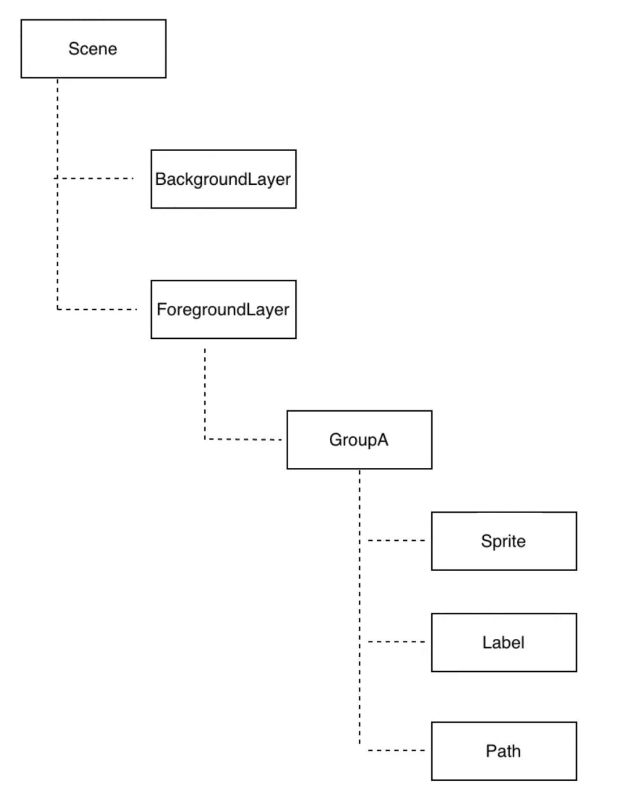

# SpriteJS：图形库造轮子
**原始需求：和渲染无关**  
D3 关心的是数据的组织，它并不关心数据最终渲染的结果，但是，D3 的数据组织形式是基于树状结构的，因为它天然契合树状结构的渲染形式。正因为如此，所以一般来说，D3 的官方例子都是用 DOM 或 SVG 渲染，这是因为基于 DOM 树的渲染和 D3 的树状数据组织形式是绝配。  

## 设计一个图形系统的“骨架”
**坐标系的选择**  
在图形系统的设计中，首先要确定默认坐标系。理论上讲，任何一种直角坐标系，甚至非直角坐标系（比如极坐标）都可以作为默认坐标系，在欧式几何中，这些坐标系都可以自由转换。不过，考虑与 DOM 的一致性，采用浏览器默认的坐标系是一个极好的选择。  
对于 WebGL 渲染来说，需要将顶点坐标转换成 WebGL 坐标，在这里，采用根据 canvas 的坐标动态设置 projectionMatrix 即可：  
``` 
updateResolution() {
  const {width, height} = this.canvas;
  const m1 = [ // translation
    1, 0, 0,
    0, 1, 0,
    -width / 2, -height / 2, 1,
  ];
  const m2 = [ // scale
    2 / width, 0, 0,
    0, -2 / height, 0,
    0, 0, 1,
  ];
  const m3 = mat3(m2) * mat3(m1);
  this.projectionMatrix = m3;
  if(this[_glRenderer]) {
    this[_glRenderer].gl.viewport(0, 0, width, height);
  }
}
```
``` 
attribute vec3 a_vertexPosition;
attribute vec3 a_vertexTextureCoord;
varying vec3 vTextureCoord;
uniform mat3 viewMatrix;
uniform mat3 projectionMatrix;
void main() {
  gl_PointSize = 1.0;
  vec3 pos = projectionMatrix * viewMatrix * vec3(a_vertexPosition.xy, 1.0);
  gl_Position = vec4(pos.xy, 1.0, 1.0);
  vTextureCoord = a_vertexTextureCoord;
}
```
**图层、树形结构与元素类型**  
SpriteJS 用 Scene 表示场景，一个 Layer 表示一个图层，在这里，我的设计是一个 Layer 对应一个画布，即默认每个 Layer 都是独立的 Canvas 元素。这么做有优点也有缺点，是一种设计上的取舍。  
优点是，每个 Layer 彼此独立，Layer 间不必考虑绘制次序，可以充分利用 WebWorker 这样的多线程来并行绘制，而且逻辑上比较简单，如果需要在多层响应事件，只需要注意事件处理的次序。缺点是如果分多层绘制，有可能产生较多 Canvas 对象实例，比较耗内存。  
_多线程绘制_
SpriteJS 采用类似树状结构来管理元素，Scene、Layer 和 Group 都是容器，而其他类型的图形元素挂载在容  



SpriteJS 的元素类型比较多，一共有超过十五种图形元素，如下图所示：


这些元素可以分为两类，一类是 Block 元素，包括 Sprite、Label 和 Group，一类是 Path 元素，包括各种图形。这两类元素中，Block 比较类似于 DOM 元素，占据矩形区域，有盒模型，有 border、padding、margin，可以计算大小；Path 比较类似于 SVG 元素，通过 Path2D 构成矢量形状，有 stroke 和 fill 两类渲染，但不计算大小（不管 Path 还是 Block 都能计算 boundingClientRect）。  
Group 比较特殊，SpriteJS v3 里，它默认不计算大小，但继承它的 Layer 和 Scene 会计算大小。在 v2 中，Group 计算大小，而且能够做区域剪裁和设置 clipPath。v3 里，Group 主要的作用是给分组元素设置统一的 transform。之所以这样设计，牵扯到 WebGL 的渲染模型。  
考虑到扩展性，用户可以通过 spritejs.registerNode 注册自定义节点元素。  
registerNode 的作用是注册一个唯一的 nodeName 到 spritejs 的文档树上，这样节点挂载之后，通过 getElementById、querySelector 等等就可以找到这个节点。  
**属性更新和重绘机制**  
SpriteJS 与一般的图形库不同，通常情况下，一般的图形库会使用一个动画定时器来以固定帧率刷新画布。但 SpriteJS 采用的是属性变化时的异步更新机制。  
具体原理如下图所示：  


需要注意的细节：
1. 不是所有的属性改变都会触发 render，比如 className、ID 等改变不会触发。
2. 有些属性改变不仅触发 render，还需要触发其他操作，比如 anchor、border 等属性的变化，需要重新计算图形元素的轮廓（后面会讲）；zIndex 的变化，导致对 group 的 children 的 renderOrder 进行重排。

**外部 Ticker**   
虽然 SpriteJS 有自己的更新机制，但是一些外部库，比如 ThreeJS 或者 ClayGL，有自己的更新逻辑，所以 SpriteJS 增加了手动控制的设计，以方便与外部库配合。  
**跨平台**  
SpriteJS 在实现的时候，尽量不使用浏览器原生提供的能力，除非是标准的 Canvas 和 WebGL API。针对浏览器、NodeJS、微信小程序、微信小游戏等不同的环境，通过 polyfill 进行适配。  

## 盒模型、事件、动画等
**盒模型设计**  
对 Block 类型的元素，SprteJS 采用标准的 DOM 盒模型，可以设置 border、padding 各属性，并可以通过 boxSizing 属性切换盒模型方式。  
**事件机制**  
- 事件模型、坐标转换

视口宽高：[viewportWidth, viewportHeight]  
画布宽高：[resolutionWidth, resolutionHeight]  
偏移量：[offsetLeft, offsetTop]  

采用对每个三角网格进行命中检测（此处有优化空间，可以先排序用二分查找快速确定范围）：  
``` 
function inTriangle(p1, p2, p3, point) {
  const a = p2.copy().sub(p1);
  const b = p3.copy().sub(p2);
  const c = p1.copy().sub(p3);

  const u1 = point.copy().sub(p1);
  const u2 = point.copy().sub(p2);
  const u3 = point.copy().sub(p3);

  const s1 = Math.sign(a.cross(u1));
  let p = a.dot(u1) / a.length ** 2;
  if(s1 === 0 && p >= 0 && p <= 1) return true;

  const s2 = Math.sign(b.cross(u2));
  p = b.dot(u2) / b.length ** 2;
  if(s2 === 0 && p >= 0 && p <= 1) return true;

  const s3 = Math.sign(c.cross(u3));
  p = c.dot(u3) / c.length ** 2;
  if(s3 === 0 && p >= 0 && p <= 1) return true;

  return s1 === s2 && s2 === s3;
}
```
**动画的设计**  
为了实现可以在时间轴按照任意速度播放动画，包括正向播放和回放，在任意时间点可以跳跃，实时切换播放状态和时间轴状态，设计了 sprite-timeline 库。  
这个库的设计是：
1. 创建一个 Timeline 对象，它基于当前时间线和 playbackRate 来计算时间，playbackRate 可以是任意数，所以时间可以停止，也可以回溯。playbackRate 的设置和改变会影响 Timeline 对象的 currentTime。
2. 除了 currentTime 属性，Timeline 对象还有一个 entropy（熵）属性，它和 currentTime 的不同是，如果 playbackRate 为负数，currentTime 会回溯，但 entropy 始终增加。
3. Timeline 对象可以 fork，fork 出的新对象以被 fork 的 Timeline 对象的 currentTime 为时间线。这意味着 Timeline 对象可以嵌套，在 SpriteJS 中，所有元素会默认 fork 它的 parent 的 timeline 对象，所以当我们把 layer 的 timeline 的 playbackRate 设置为 0 的时候，这个 layer 中所有的动画就都会暂停。

### 从 2D 到 WebGL
在 Sprite 1.0 和 2.0 的时候，主要是使用 Canvas2D 渲染，直到 3.0，重写了底层引擎，开始默认采用 WebGL 渲染。  
**轮廓和网格**  
为了便于 WebGL 处理几何图形，尤其是 Path 的解析，实现了一个底层渲染引擎 GitHub - mesh-js/mesh.js: A graphics system born for visualization,将 2D 几何图形分解成轮廓和网格对象，这有点像是 ThreeJS 中的 Geometry 和 Material，只不过因为要处理的实际上是 2D 图形，所以模型更加简单。  
在 mesh.js 中，要绘制一个几何图形，先构建该元素的轮廓（Figure/Contours），然后再根据轮廓创建网格对象。经过这样两个步骤之后，可以将几何图形绘制出来，这个过程其实比较像 Canvas2D，只是比 Canvas2D 稍复杂一点点。  
**三角剖分**  
WebGL 的基本图元只有点、线、三角形等，要绘制多边形，需要将图形进行三角剖分。对任意多边形进行三角剖分，有许多成熟算法，选择 GLU Tessellator。
通过一系列工具库 parse-svg-path、normalize-svg-path、svg-path-contours（https://github.com/mesh-js/mesh.js/tree/master/src/svg-path-contours）将 SVGPath 转换成多边形的顶点列表  
获得顶点之后，对顶点进行三角剖分，就可以得到三角网格的拓扑结构，通过这个拓扑结构创建 mesh2d 对象。  
**Stroke**  
如果不常用 WebGL 渲染，很难想象，对 Canvas2D 来说非常简单的绘制带宽度折线这类需求，会难住 WebGL 开发者。  
其实这个问题已经有比较经典的解决方案，就是用挤压（extrude polyline）曲线技术来实现。有两种方法，一种是用 JS 算顶点，另一种是在 shader 中进行处理。为了灵活实现 Canvas2D 中的“线帽（lineCap）”效果，SpriteJS 采用 JS 计算的方式来处理。  
如上图所示，黑色折线是原始的 1 个像素宽度的折线，蓝色虚线组成的是我们最终要生成的带宽度曲线，红色虚线是顶点移动的方向。因为折线两个端点的挤压只和一条线段的方向有关，而转角处顶点的挤压和相邻两条线段的方向都有关，所以顶点移动的方向，我们要分两种情况讨论。  
首先，是折线的端点。假设线段的向量为（x, y），因为它移动方向和线段方向垂直，所以我们只要沿法线方向移动它就可以了。根据垂直向量的点积为 0，我们很容易得出顶点的两个移动方向为（-y, x）和（y, -x）。
端点挤压方向确定了，接下来要确定转角的挤压方向了  
假设有折线 abc，b 是转角。延长 ab，就能得到一个单位向量 v1，反向延长 bc，可以得到另一个单位向量 v2，那么挤压方向就是向量 v1+v2 的方向，以及相反的 -(v1+v2) 的方向。  
得到了挤压方向，接下来就需要确定挤压向量的长度。  
首先是折线端点的挤压长度，它等于 lineWidth 的一半。而转角的挤压长度就比较复杂了，需要再计算一下。  
绿色这条辅助线应该等于 lineWidth 的一半，而它又恰好是 v1+v2 在绿色这条向量方向的投影，所以，可以先用向量点积求出红色虚线和绿色虚线夹角的余弦值，然后用 lineWidth 的一半除以这个值，得到的就是挤压向量的长度了。  
具体用 JavaScript 实现的代码如下所：
``` 
function extrudePolyline(gl, points, {thickness = 10} = {}) {
  const halfThick = 0.5 * thickness;
  const innerSide = [];
  const outerSide = [];

  // 构建挤压顶点
  for(let i = 1; i < points.length - 1; i++) {
    const v1 = (new Vec2()).sub(points[i], points[i - 1]).normalize();
    const v2 = (new Vec2()).sub(points[i], points[i + 1]).normalize();
    const v = (new Vec2()).add(v1, v2).normalize(); // 得到挤压方向
    const norm = new Vec2(-v1.y, v1.x); // 法线方向
    const cos = norm.dot(v);
    const len = halfThick / cos;
    if(i === 1) { // 起始点
      const v0 = new Vec2(...norm).scale(halfThick);
      outerSide.push((new Vec2()).add(points[0], v0));
      innerSide.push((new Vec2()).sub(points[0], v0));
    }
    v.scale(len);
    outerSide.push((new Vec2()).add(points[i], v));
    innerSide.push((new Vec2()).sub(points[i], v));
    if(i === points.length - 2) { // 结束点
      const norm2 = new Vec2(v2.y, -v2.x);
      const v0 = new Vec2(...norm2).scale(halfThick);
      outerSide.push((new Vec2()).add(points[points.length - 1], v0));
      innerSide.push((new Vec2()).sub(points[points.length - 1], v0));
    }
  }
  ...
}
```
**批量绘制**  
绘制 2D 图形，通常这些图形可视为同一材质，所以能够将这些图形网格数据全部压缩到一个大的类型数组中进行批量绘制。  
**Shader & Pass**  
SpriteJS 可以使用自定义 shader 创建 Program，将 Program 赋给绘图元素进行绘制。  
可以在渲染管线中应用多个 shader 组成管道进行渲染，有一种特定的渲染管道叫做后期处理通道，SpriteJS 支持定义后期处理通道。  

### 关于性能优化的那些事儿
**性能的直观感受**  
SpriteJS 针对可视化场景进行了性能优化。可视化场景中有大量重复或类似形状的几何图形，因此用合并顶点批量渲染的方式会很有效。  

**auto Blending 和轮廓更新**  
WebGL 在颜色混合的时候比较消耗性能，因此 mesh-js 对元素做了判断，如果当前绘制的元素都没有 alpha 通道（透明度），那么不会开启颜色混合，否则再开启颜色混合。  
在 SpriteJS 中，元素的大部分样式改变，比如 transform、position、bgcolor 等等，不涉及轮廓的变化，这些情况下，不用重新计算轮廓，所以将元素轮廓计算好之后缓存起来，大部分情况下我们不需要重复计算。只有一些特殊属性，比如 Path 的 d、lineWidth、lineCap、Block 的 border 等改变，才需要重新计算轮廓。  
**Seal & Cloud**  
Seal 是一种特殊的方式，当使用一个 group 来组合一组图形时，如果只是需要使用固定的图形拓扑结构，可以使用 group 的 seal 方法将子元素的几何图形合并成为 group 的几何图形。这样 group 的几何图形将被合并的几何图形替代，成为一个单一的元素被渲染，并且不再能够改变几何图形（但是依然可以改变位置、transform、颜色等等属性）。  
seal 生效的时候，原子元素的属性将失效，由 group 的属性替代。  
用 group 构建组合图形的时候，这种特殊方式能够大大提升渲染性能。  
对于绘制完全重复的几何图形，还可以利用 WebGL 的来进行渲染。  

**关于 Shader 的性能开销**
有一条需要格外注意：尽量使用条件编译代替条件分支。

原文:  
[SpriteJS：图形库造轮子的那些事儿](https://mp.weixin.qq.com/s/-L7BVHxP1HiS_3NS3WGUtQ)
