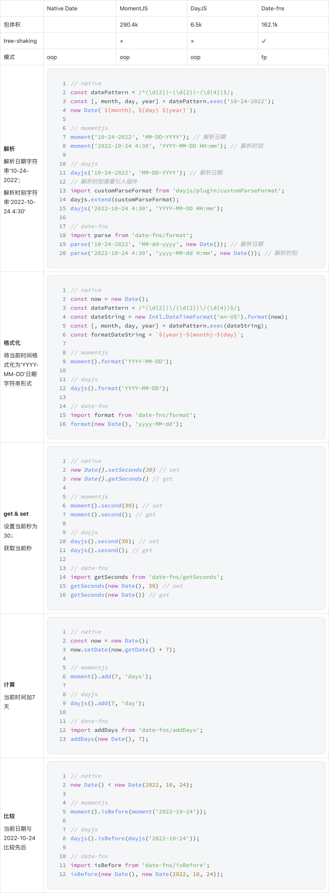

# 主流时间库横向对比
## 时间
**计量标准**  
时间包含了时刻和时段两个概念，常规意义上的时段是可以通过两个时刻计算得到的，但地球自转的不稳定，这种方式得到的时段并不是恒定的，因而诞生了两种时间计量系统：  
1. 世界时（GMT）：根据地球自转的天文测量得到，并不稳定
2. 原子时（IAT）：根据原子的单次振动时间得到，可以认为是恒定不变的

**时区**  
全球被划分为 24 个时区。规定英国的格林威治天文台旧址所在经线为基准线，即本初子午线，所在时区为零时区，零时区以东为东 1-12 区，以西为西 1-12 区（东 12 区和西 12 区是重合的）。每差一个时区，区时相差一小时，越往东区时越早。为了让世界各地都有一个统一的参照时间，规定零时区的 UTC 时间作为标准时间，简称 UTC 时间。  

## new Date()
**YYYY-MM-DD 的时区问题**  
- 使用 new Date('YYYY-MM-DD') 实例化 Date 对象时，由于没有指定具体时刻，系统会自动设置一个时刻为 '00:00:00' 的 UTC 时间，并在用户访问时，返回系统时区的对应时间。如，位于东八区的开发者访问 Date 显示的时间是 UTC+8。位于西七区的开发者访问 Date 显示的时间是 UTC-7。也就是说，如果直接使用 new Date('YYYY-MM-DD') 设置时间，位于不同时区的用户会获取不同的结果，某些情况下会导致意想不到的 bug
- 使用 new Date('YYYY-MM-DD HH-MM-SS') 或其他官方推荐的日期格式实例化对象，如new Date(DD, MM YYYY)，可以避免上述时区问题，创建当前时区下 00:00:00 的 Date 对象

``` 
// 时区为中国
var date1 = new Date('2022-10-24')
// Mon Oct 24 2022 08:00:00 GMT+0800 (中国标准时间)

// 时区为美国
var date2 = new Date('2022-10-24')
// Sun Oct 23 2022 17:00:00 GMT-0700 (北美太平洋夏令时间)

// 使用 new Date('YYYY-MM-DD HH-MM-SS') 可以创建当前时区的 Date 对象
var date3 = new Date('2022-10-24 00:00:00')
// Mon Oct 24 2022 00:00:00 GMT+0800 (中国标准时间)

// 传入格式为'DD, MM YYYY'的日期
var date4 = new Date('10, 24 2022')
// Mon Oct 24 2022 00:00:00 GMT+0800 (中国标准时间)
```

**Safari 的兼容性问题**  
Safari 只支持 YYYY/MM/DD 或 MM/DD/YYYY 或 MMMM DD, YYYY 格式的日期，使用 new Date('YYYY-MM-DD') 会报错。  

**无法解析或展示特定格式的日期**  
特定格式日期的解析需要借助正则表达式来完成  
``` 
// 通过正则表达式解析
const datePattern = /^(\d{2})-(\d{2})-(\d{4})$/;
const [, month, day, year] = datePattern.exec('10-24-2022');
new Date(`${month}, ${day} ${year}`);
```

## 主流时间库
**MomentJS**  
- 彻底解决解析问题和格式化问题
    ```
     const date1 = moment('2022-10-24');
     console.log(date1.format())   // 2022-10-24T00:00:00+08:00
     console.log(date1.toArray())  // [2022, 9, 24, 0, 0, 0, 0]，注：月份的起始数为0
     console.log(date1.toJSON())   // 2022-10-23T16:00:00.000Z
    ```
- 适配多种甚至自定义的格式写法
    ```
     const date2 = moment('10/24/2022', 'MM/DD/YYYY');
     const date3 = moment('2022-10-24-4-30', 'YYYY-MM-DD-HH-mm');
    ```    
- 包体积大：MomentJS 包体积十分庞大，接近 300kb，且基于 OOP（Object Oriented Programming）的设计需要先引入 moment 对象，再使用对象中的方法，导致无法通过 tree-shaking 压缩体积，引用后会打包所有方法，容易引发首屏加载的性能问题。
- 时间对象是可变的（mutable）：对时间对象的计算操作会改变对象本身，通常需要拷贝后操作
    ```
     const startDate = moment(); // Sun Oct 23 2022 23:11:34 GMT+0800
     const endDate = startDate.add(1, 'year'); // Mon Oct 23 2023 23:11:34 GMT+0800
     console.log(startDate === endDate);   // true
    ```

目前 moment.js 由于历史包袱升级困难， 加上更好的替代品出现，已经停止维护。对于深度使用 moment.js 但希望更换时间库的项目，可以安装 eslint-plugin-you-dont-need-momentjs 来帮助升级。配置方式如下：  
``` 
// package.json
"extends" : ["plugin:you-dont-need-momentjs/recommended"]
```
## DayJS
是 Moment.js 的轻量化方案，拥有同样强大的 API，但包体积只有 6.5KB  
- 不可变（Immutable）
- 体积小。为了减小体积，day.js 将一些复杂功能抽离到插件中，使用时需额外引入
- 拥有和 MomentJS 相同的 API，迁移成本低。但迁移时需注意：

> 注：涉及到更改时间对象的操作，不能简单地替换  

``` 
mport moment from "moment";
const timeEntity = moment();
timeEntity.add(1, "d"); // 天数加1

import dayjs from "dayjs";
const timeEntity = moment();
timeEntity = timeEntity.add(1, "d"); // 天数加1
```
如果项目中大量依赖此类逻辑的话，Day.js 插件提供了适配方案用，虽然官方并不推荐  
``` 
var badMutable = require('dayjs/plugin/badMutable')
dayjs.extend(badMutable) // with BadMutable plugin
const today = dayjs()
today.add(1, 'day') // immutable
```

> 注：一些特殊功能需要通过插件额外引入，并进行配置。

``` 
import dayjs from "dayjs";
import dayOfYear from "dayjs/plugin/dayOfYear";
import objectSupport from "dayjs/plugin/objectSupport";

// 配置插件
dayjs.extend(dayOfYear);
dayjs.extend(objectSupport);

export default dayjs;
```

**Date-fns**  
Date-fns 的 API 是基于 FP（Functional Programming）的，可以按需导入函数  
- 不可变（Immutable）
- 函数导入，但相比对象导入，调用不够灵活，每个工具函数都要从指定路径引入

    ``` 
    export addDays from 'date-fns/addDays/index.js'
    const newDate = addDays(new Date(), 7);
    ```
    优化：将需要用到的工具函数引入到模块文件中，再对外暴露方法。
    ``` 
    // custom-date-fns.js
    export { default as add } from 'date-fns/add/index.js'
    export { default as addBusinessDays } from 'date-fns/addBusinessDays/index.js'
    export { default as addDays } from 'date-fns/addDays/index.js'
    export { default as addHours } from 'date-fns/addHours/index.js'
    ```
- 支持 tree-shaking，某些情况下具有更小的引入体积

**横向对比**  


原文:  
[主流时间库横向对比](https://mp.weixin.qq.com/s/pRdT-5f-6pVRj44UsUkq7g)
