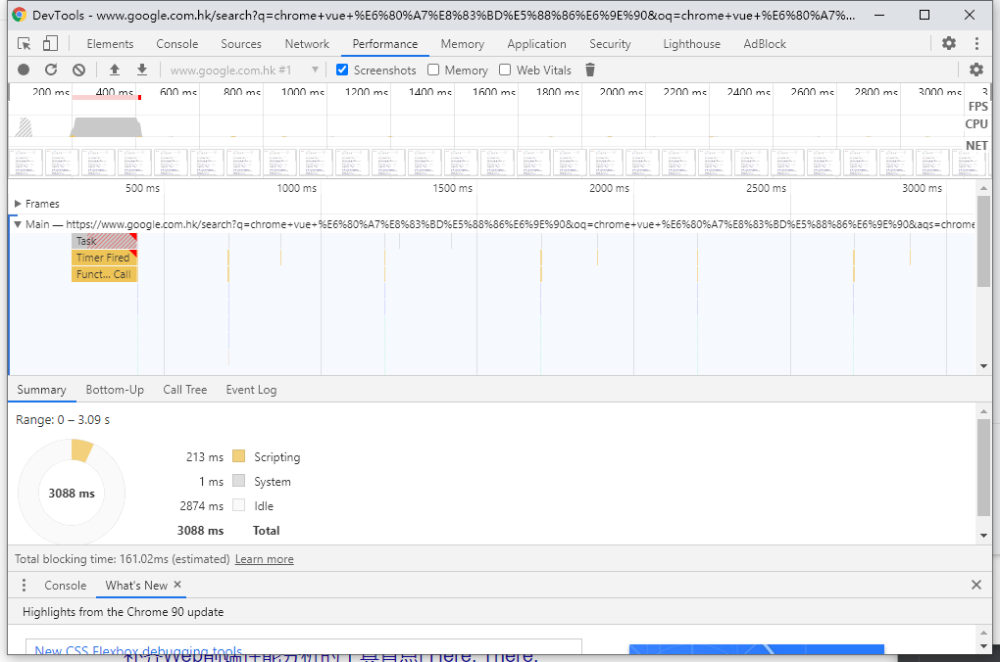
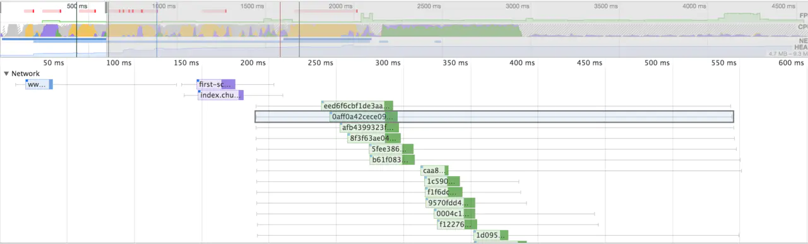
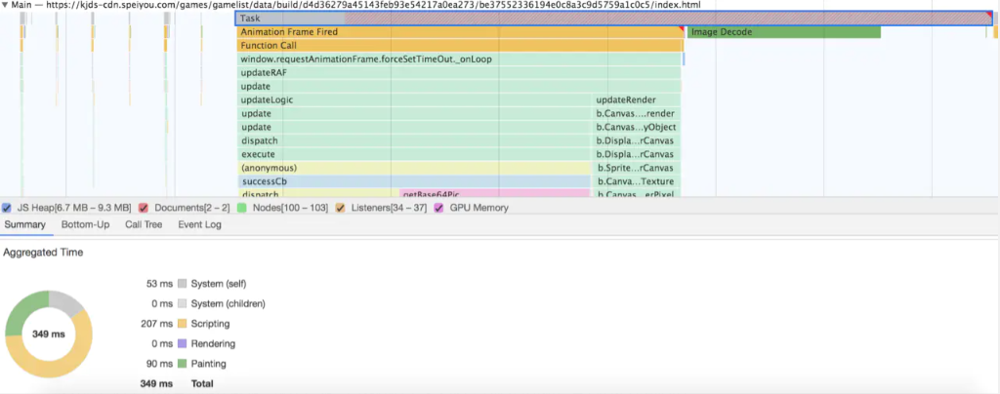
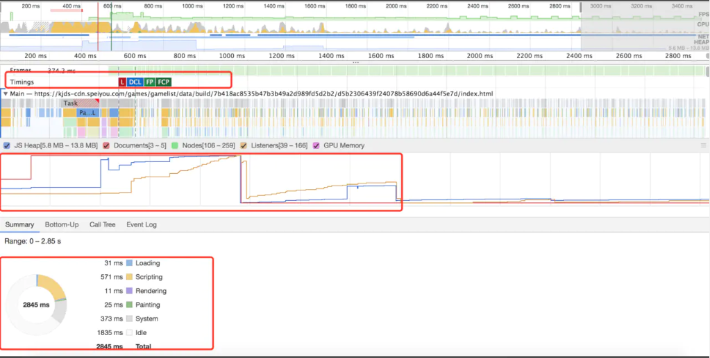

# Vue长列表性能分析
## 准备工作
- 打开performance选项卡
- 点击最右边的设置的小齿轮图标，如果是移动端项目，打开CPU节流开关，根据电脑性能选择相应的
- 如果勾选memory还可以看到占用内存的不同组成部分在记录过程中的变化，根据变化的情况看到大致的垃圾回收的周期，以及有无明显的内存泄漏的情况  
  

## 概览
图片是整体的页面渲染的时候，每个时间段执行的事件顺序，可以看到每个时间段都做了什么，每个时间段页面的渲染情况，Performance将几个关键指标，如页面帧速（FPS）、CPU资源消耗，网络请求流量，V8内存使用量等，按照时间顺序做成图表的形式展现出来
**FPS（Analyze frames per second）**
帧率；FPS的红色横条表明帧率过低影响用户体验，通常情况下帧率越高，体验越好，当帧率不影响使用的时候横条是不会出现的
**CPU**
对应summary Tab相一致 
## 性能面板
- Network可以直观看到资源加载的顺序与时长
- Interaction记录用户交互操作
- Timings记录一些关键的时间点在何时产生的数据信息，诸如FP、FCP、LCP等
- Main是Performance工具中比较重要的部分，记录渲染进程中主线程的执行记录，点main可以看到某个任务执行的具体情况
- Compositor合成线程的执行记录，用来记录html绘制阶段结束后的图层合成操作
- Raster光栅化线程池，用来让GPU执行光栅化的任务
- GPU进程主线程的执行过程记录，如可以直观到何时启动GPU加速
- Memory选项，在勾选后悔显示折线图，该图可以看出在不同的时间段的执行情况。我们可以看到页面中的内存使用的情况，比如 JS Heap(堆)，如果曲线一直在增长，则说明存在内存泄露，如果相当长的一段时间，内存曲线都是没有下降的，这里是有发生内存泄露的可能的。
## Summary
统计检测性能的时间范围内，都做了哪些事情
Loading：加载时间  
Scripting：js计算时间  
Rendering：渲染时间  
Painting： 绘制时间
Other： 其他时间
Idle：浏览器闲置时间  

## 实践
### 网络&&白屏
   
我们可以看几点信息：  
- 页面加载的白屏时间约为 150 ms
- 没有启用 http2，因此每次可以同时加载的图片数有限，未被加载的图片有等待过程
- 可以看一下资源加载有没有空白期，虽然上图没有，但是如果资源加载之间存在空白期，说明没有充分利用资源加载的空闲时间，可以调整一下
## 火焰图
   
面板中会有很多的 Task，如果是耗时长的 Task，其右上角会标红，这个时候，我们可以选中标红的 Task，然后放大
放大后，这里可以看到都在做哪些操作，哪些函数耗时了多少,这里代码有压缩，看到的是压缩后的函数名。然后我们点击一下某个函数，在面板最下面，就会出现代码的信息，是哪个函数，耗时多少，在哪个文件上的第几行等。这样我们就很方便地定位到耗时函数了。  
同时也可以查看 Main 指标分析代码里面是否存在强制同步布局等操作，分析出来这些原因之后，我们可以有针对性地去优化我们的程序  
## 时间线&&内存情况
   
- FCP: First Contentful Paint
- LCP: Largest Contentful Paint
- FMP: First Meaningful Paint
- DCL: DOMContentLoaded Event
- L: Onload Event
可以看到页面中的内存使用的情况，比如 JS Heap(堆)，如果曲线一直在增长，则说明存在内存泄露。如果Nodes和Listeners不断增加说明可能存在重复添加节点或者事件的情况。最下方就是页面的一个整体耗时概况，如果 Scripting 时间过长，则说明 js执行的逻辑太多，可以考虑优化js，如果渲染时间过长，则考虑优化渲染过程，如果空闲时间过多，则可以考虑充分利用起来，比如把一些上报操作放到页面空闲时间再上报等。

原文:
[Chrome Performance 页面性能分析指南](https://juejin.cn/post/6850418121548365831)
