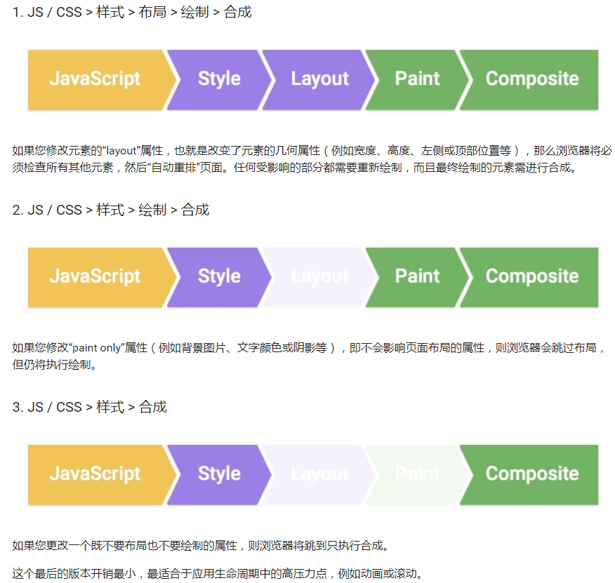

# 拯救动画卡顿之FLIP
**什么是FPS**
FPS是浏览器的每秒的渲染帧数，也就是浏览器切换画面的次数，大多数设备的刷新率都是60FPS，一般来说FPS越低页面就会越卡顿。  

**什么是像素管道**  
像素管道是浏览器单个帧的渲染流水线，如果其中有某些环节执行过程过长就会导致卡顿
- JavaScript。通常来说，阻塞的发起都是来自于 JS ，这不是说不用 JS，而是要正确的使用 JS 。首先，JS 线程的运行本身就是阻塞 UI 线程的（暂不考虑 Web Worker）。从纯粹的数学角度而言，每帧的预算约为 16.7 毫秒（1000 毫秒 / 60 帧 = 16.66 毫秒/帧）。但因为浏览器需要花费时间将新帧绘制到屏幕上，只有 ~10 毫秒来执行 JS 代码，过长时间的同步执行 JS 代码肯定会导致超过 10ms 这个阈值，其次，频繁执行一些代码也会过长的占用每帧渲染的时间。此外，用 JS 去获取一些样式还会导致强制同步布局。
- 样式计算（Style）。此过程是根据匹配选择器（例如 .headline 或 .nav > .nav__item）计算出哪些元素应用哪些 CSS 规则的过程，这个过程不仅包括计算层叠样式表中的权重来确定样式，也包括内联的样式，来计算每个元素的最终样式
- 布局（Layout）。在知道对一个元素应用哪些规则之后，浏览器即可开始计算该元素要占据的空间大小及其在屏幕的位置。网页的布局模式意味着一个元素可能影响其他元素，一般来说如果修改了某个元素的大小或者位置，则需要检查其他所有元素并重排（re-flow）整个页面
- 绘制（Paint）。绘制是填充像素的过程。它涉及绘出文本、颜色、图像、边框和阴影，基本上包括元素的每个可视部分。绘制一般是在多个表面（通常称为层）上完成的，绘制包括两个步骤：1) 创建绘图调用的列表， 2) 填充像素，后者也被称作栅格化。
- 合成（Composite）。由于页面的各部分可能被绘制到多个层上，因此它们需要按正确顺序绘制到屏幕上，才能正确地渲染页面。尤其对于与另一元素重叠的元素来说，这点特别重要，因为一个错误可能使一个元素错误地出现在另一个元素的上层。  

上述的五个阶段并不是一定都会执行到的，这五个阶段中涉及到了老生常谈的两个概念：重排跟重绘，虽然初次渲染布局跟绘制必不可少，但是后期我们可以控制避免通过这两个管道：以下是当我们修改不同的样式属性时，会触发的几种帧流程：  



从上图中能看到JS阶段以及Style 和 Composite阶段 是不可避免的，因为需要 JS 来引发样式的改变，Style 来计算更改后最终的样式，Composite 来合成各个层最终进行显示，能跳过的步骤只有布局跟绘制，我们知道，执行的阶段越少，耗时就越少，每秒的渲染帧数就会越高，那么能不能直接跳过这两个步骤直接到合成呢？答案是肯定的，如下的属性只会触发合成阶段：transform、opacity、pointer-events、perspective （透视效果）、curosr、orphans设置当元素内部发生分页时必须在页面底部保留的最少行数（用于打印或打印预览）、widows（设置当元素内部发生分页时必须在页面顶部保留的最少行数（用于打印或打印预览））。

## FLIP
写动画的时候如果用height margin padding left等会触发重排的属性，相较于只用transform或者opacity会带来更多的性能开销，一旦这个计算时长超过1个动画帧(一般是60帧每秒,也就是说超过16.7ms), 那么这帧动画将不会绘制，产生页面卡顿。FLIP技术，就是一种让动画只利用到transform或者opacity的技巧，FLIP是 First, Last, Invert, Play的简称。  

### 概念
**First**  
对应动画的Start阶段，用 element.getBoundingClientRect()记录初始位置。  
**Last**  
对应动画的End阶段，先执行触发layout变动的代码，同样的用element.getBoundingClientRect()记录元素的终止位置。  
**Invert**  
现在元素处于End位置，利用 transform 做一个逆运算，让添加了 transform 的元素回归到初始位置。  
**Play**  
真正需要执行动画时，将 transform 置为 None  
getBoundingClientRect不是也会触发重排吗？但是需要注意的是我们的重心是在动画阶段，要保障的是动画阶段的流畅，更何况用户在网页上进行交互时，比如click，touch，从交互结束到感知到程序的相应大约需要100ms的生理反应时间。我们在用户交互后要做100ms内准备好动画就好了，这些动画准备计算就是getBoundingClientRect(或getComputedStyle)等的计算。  
## 实践
实现一个简单的从左到右的循环滚动动画  
``` 
const playAnimate = (el) => {
    if (!el) return;
    // 记录初始位置，对应 FLIP的FIRST
    const pos = tagWrapperRef.current?.getBoundingClientRect();
    const { left: initLeft } = pos;
   // 设置元素样式为动画结束时的目标位置
   tagWrapperRef.current.classList.add('scroll-to-end');
   // 记录终止位置 对应FLIP的LAST
    const endPos = tagWrapperRef.current?.getBoundingClientRect();
    const { left: endLeft } = endPos;
    // 计算初始位置跟终止位置的偏差
    const deltaLeft = initLeft - endLeft;
    tagWrapperRef.current.animate(
      [
      // 动画开始时，利用 `transform` 做一个逆运算，让添加了 `transform` 的元素回归到初始位置。
        {
          transform: `translate(${deltaLeft}px,0)`,
        },
        {
          transform: 'none',
        },
      ],
      {
        duration: totalTime * 1000,
        easing: 'linear',
        iterations: Infinity,
      }
    );
 }
 
 // css
 .scroll-to-end{
  left:100%
  }
```
采用FLIP的形式成功的避开了动画过程中更改left。我们注意到：我们可以在动画开始前预先用API计算元素在动画终止时候的位置，只要知道了终态跟初始状态，就能迅速计算出要达到终态该怎么移动，由此避开一些复杂的计算，由此我们也可以得出：除了用来做性能优化之外，FLIP也能用于简化某些场景下动画的实现过程，如以下几个场景：  
- 元素宿主元素的变化，比如将元素从A移动到B
- 容器大小变化
- 图片展开和收缩效果
- 项目删除和添加时填充空白区域的效果
- 网格项的重新排序 举个例子，如第三个场景，如若添加或者删除的卡片的大小是未知的，如果用常规的方式移动其他卡片将变得困难，而如果使用FLIP，问题将迎刃而解

``` 
// Last
if (updateType === 0) { 
// 增加卡片 
newListData = this.state.listData.slice(0, activeIndex).concat({ index: cardIndex++ 
}, this.state.listData.slice(activeIndex)) 
} else { 
// 删除卡片 
newListData = this.state.listData.filter((value, index) => index !== activeIndex)
}

// Invert

// 0 增加 1 删除
const updateIndex = updateType === 0 ? 1 : 0
activeList.forEach((item, index) => {
  rect = item.getBoundingClientRect()
  invertArr[index + updateIndex][0] = invertArr[index + updateIndex][0] - rect.left
   invertArr[index + updateIndex][1] = invertArr[index + updateIndex][1] - rect.top
 ...
```

## 使用FLIP形式需要注意什么
- FLIP中的前三个阶段也就是前期的准备工作需要在绘制这个步骤之前，也就是时间需要尽可能的控制在之前提到的100ms以内，否则的话 渲染的过程中可能出现闪烁，但是我们怎么才能抓住绘制前这个时机呢？本人用React比较多，以React为例：答案是useLayoutEffect，它接受一个回调函数，这个函数会在dom更新后、重绘之前同步的执行

实现一个点击方块互换位置的动画
``` 
const Flipper = () => {
  const [ids, setIds] = React.useState(["square-1", "square-2"]);
  const rects = React.useRef(new Map()).current;

  const swap = ([a, b]) => [b, a];

  React.useEffect(() => {
    const squares = document.querySelectorAll(".square");
    
    // Cache position and size once on initial render
    for (const square of squares) {
      rects.set(square.id, square.getBoundingClientRect());
    }
  }, []);

  React.useLayoutEffect(() => {
    const squares = document.querySelectorAll(".square");

    for (const square of squares) {
      // Get previous size and position from cache
      const cachedRect = rects.get(square.id);

      if (cachedRect) {
        const nextRect = square.getBoundingClientRect();
        
        // Invert
        const translateX = cachedRect.x - nextRect.x;
        
        // Cache the next size and position
        rects.set(square.id, nextRect);
        
        // Play
        square.animate(
          [
            { transform: `translateX(${translateX}px)` },
            { transform: `translateX(0px)` }
          ],
          1000
        );
      }
    }
  }, ids);

  return (
    <div className="container">
      {ids.map((id, i) => {
        return (
          <div id={id} onClick={() => setIds(swap(ids))} className={`square`}>
            {id}
          </div>
        );
      })}
    </div>
  );
};

ReactDOM.render(<Flipper />, document.querySelector("#root"));
```
虽然useEffect总是在useLayoutEffect以及浏览器绘制之后执行，但是注意到这里我们仅仅在第一次渲染之后执行了，而这里的useLayoutEffect在之后的每一次渲染之后都会执行。  
- 避免多次触发重排 可能会有的人“读”“写”一起进行。

错误的做法：循环遍历元素并使用 getBoundingClientRect 读取它们的位置，然后立即使用 animate 为它们设置动画。  
正确的做法：批量的读取与写入  

原文:  
[拯救动画卡顿之FLIP](https://mp.weixin.qq.com/s/la10K7yp77xsSOqUKQkl3A)
