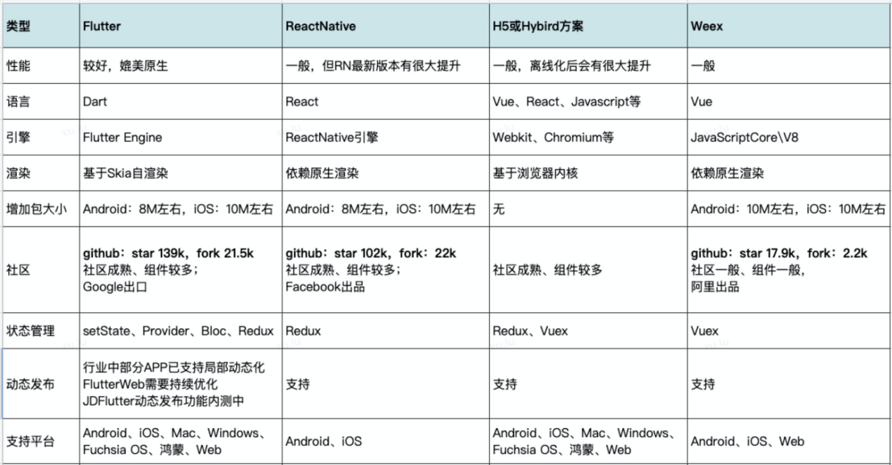

# App常用跨端技术栈深入分析
随着技术的发展，产生了越来越多的端，如Android、iOS、Mac、Windows、Web、Fuchsia OS、鸿蒙等，而随着公司业务的发展，出现了越来越多的业务场景；作为APP开发人员，在日常工作中难免会碰到以下问题，如：1、UI设计师在进行UI审查时、测试同学在回归测试过程中、业务方在使用过程中，多少会发现端与端存在着差异，影响用户体验；2、同样的业务、同样的功能在不同的端上，需要每端投入资源去开发实现。而移动互联网的发展已经处于晚期，领导们越来越关心投入产出。  
与此同时，出现了一些跨端的技术解决方案，可以实现一套代码在多端运行，解决业务发展上的痛点，如Flutter、ReactNative、Weex、H5（注：小程序和其它基于DSL的方案暂不在本文讨论范围）。然后对一些常用APP进行了对比分析，结论和预期一致，大部分都在使用跨端技术；Flutter和ReactNative使用率较高，Weex使用率相对低一些，H5基本都在使用，使用多种跨端技术框架是一种常态。那么，它们都有哪些特点呢?   

通过图,从性能、开发语言、渲染、包大小、社区、支持平台等方面梳理了它们的主要特点；不由产生几个问题：为什么原生和Flutter性能更好？为什么ReactNative和Weex性能相对较差？为什么H5页加载慢？这些性能问题该如何去优化，这是需要深入了解的问题，下面将从基本的架构、渲染流程、编译运行原理等一起分析。  

**Flutter基础架构介绍**  
Flutter基础架构  
Framework层：基于Dart实现，主要包括Text、Image、Button、动画、手势等各种Widgets，核心基础类库io、async、ui等package；基于Framework开发App，其运行在Engine层上，Framework和逻辑层都在基于Dart语言开发，对于开发而言，一切都是Widget，Widget是UI实现的基础；Engine层：基于C++、C实现；主要包括Skia渲染引擎库Framework层：基于Dart实现，主要包括Text、Image、Button、动画、手势等各种Widgets，核心基础类库io、async、ui等package；基于Framework开发App，其运行在Engine层上，Framework和逻辑层都在基于Dart语言开发，对于开发而言，一切都是Widget，Widget是UI实现的基础；Engine层：基于C++、C实现；主要包括Skia渲染引擎库  
对于Flutter Web，Framework层是公用的，意味着业务层可以使用此层的widgets实现逻辑跨端；但Engine层则不同，需要通过Canvas Render或者 HTML Render对齐Engine的能力。2022年5月Google IO大会发布Flutter 3.0，除了移动端，更好的支持了Mac OS、Linux平台，也包括其它一系列优化和支持
**ReactNative基础架构**  
ReactNative是Facebook于2015年开源，主要服务于Android和iOS两端，采用React开发实现逻辑侧代码（也可应用于前端），采用Redux实现状态管理，在APP中UI渲染、网络请求、动画等均由原生侧桥接实现；在这里实际运行过程中，js侧的dom会形成一个virtual dom，并通过bridge桥接将此dom结构传输到原生侧，原生侧会解析并映射到原生控件，形成原生的dom结构后，再调用原生能力进行渲染展示。  
2021年ReactNative新版本对底层进行了重构，如改变线程模型，引入异步渲染能力，允许多个渲染并简化异步数据处理，简化 JSBridge等。
**Weex基础架构介绍**  
Weex是阿里2016年发布的跨端框架，Weex编译产物js bundle可以部署在服务端，APP加载完即可运行，也可以看出具备动态发布的能力；和ReactNative类似，Weex在实际运行过程中，js侧会形成一个dom，并通过Bridge交由原生侧解析，映射到原生控件再由原生能力进行渲染；Weex基于JS V8引擎，基于Vue设计，支持Android、iOS、Web三端。  
**WebView基础架构介绍**  
WebView内核模块较复杂,架构主要的几个部分：桥接协议是上层逻辑测与WebView的通信层，是JS和Native互相通信的能力层；  
WebCore是浏览器加载和排版渲染页面的基础，主要包括资源加载、HTML解析、CSS解析、DOM解析、排版渲染等，JavaScript引擎是JavaScript解析器，JavaScriptCore是Webkit的JavaScript引擎，V8是Google的Blink的默认引擎；WebKit Ports是WebKit中移植部分，包括网络、字体、图片解码、音视频解码、硬件加速等模块；然后再往下也使用了很多第三方库，包括2D图形库、3D图形库、网络库、存储库、音视频库等；最底层是操作系统，支持Android、iOS、Windows等系统。  
**编译原理分析**  
Flutter支持Release、Profile、Debug编译模式。  
Release模式即使用AOT预编译模式，预编译为机器码，通过编译生成对应架构的代码，在用户设备上直接运行对应的机器码，运行速度快，执行性能好；此模式关闭了所有调试工具，只支持真机。对于编译产物，iOS侧主要生成App.framework和Flutter.framework；App.framework为dart代码编译产物，Flutter.framework为引擎编译产物；Android侧主要在lib下增加了libapp.so和libflutter.so，libapp.so为dart代码编译产物，libflutter.so为引擎编译产物，不同的是在assets下增加了flutter_assets存放引用资源文件。  
Profile模式和Release模式类似，此模式最重要的作用是可以用DevTools来检测应用的性能，做性能调试分析。  
Debug模式使用JIT即时编译技术，支持常用的开发调试功能hot reload，在开发调试时使用，包括支持的调试信息、服务扩展、Observatory、DevTools等调试工具，支持模拟器和真机。iOS侧主要生成App.framework和Flutter.framework，在App.framework文件夹里多了isolate_snapshot_data，kernel_blob.bin，vm_snapshot_data；Android侧也同样多了多了以上文件，但lib下少了libapp.so文件。  
ReactNative整体分为逻辑侧和渲染侧，逻辑侧基于js引擎，会将基于React写的代码编译为JavaScript原生代码，再编译生成jsbundle文件，内置或下发到APP端运行；而渲染侧依赖于Android或iOS原生渲染，需要分平台编译对应的编译产物，然后发布到服务端或内置到APP。  
Weex和ReactNative类似，weex会将源码编译为js bundle，这些js bundle可以部署在服务端，APP下载完js bundle后，通过js引擎构建虚拟dom并通过桥接映射到原生dom，由原生渲染引擎进行渲染。  
H5：以React和Vue为例，会将以框架开发的代码编译为JavaScript原生代码，即然后在浏览器或者WebView中执行；内核会先建立连接、加载资源，然后解析、排版布局、绘制渲染呈现给用户。
**基本渲染流程对比**  
基于Android和iOS原生开发APP，调用Framework框架层实现上层逻辑，经过布局绘制后直接调用系统渲染引擎进行渲染展示；基于Flutter开发APP，会直接调用Skia渲染引擎进行渲染展示；不依赖于原生渲染。  
基于ReactNative或Weex开发APP则不同，首先业务逻辑是基于React或Weex开发，然后会将js bundle包预置或下载到APP，然后将虚拟dom通过bridge映射到原生控件，再调用原生渲染引擎进行渲染展示。  
基于Hybrid方案开发APP，需要通过React、Vue等前端框架实现，首页要编译为JavaScript原生语言，然后通过链接在WebView或浏览器加载页面，关键的流程是连接加载、解析、排版、绘制，最后再调渲染引擎进行展示。  
通过以上所有分析，可以回答前面提出的问题：  
为什么原生和Flutter性能更好？主是都是经过布局绘制后直接调系统或自带渲染引擎进行展示。  
为什么ReactNative和Weex性能相对慢？主要是需要下载js bundle包，并把js dom结构解析映射到原生，而下载和预置都比较耗时，并且依赖原生进行渲染（ReactNative新版本升级了基础架构，据说有较大性能提升，大家也可以关注）。  
为什么H5页加载慢？主要因为连接和加载比较耗时，这里占大部分时间，连接和加载完以后基本就是WebView或浏览器本地可以完成的工作，后期优化也可以以此为切入点。  
## 常见主要性能问题优化
**如何优化Flutter性能**  
关键优化指标：页面异常率、页面FPS帧率、页面加载时长。  
页面异常率（异常发生次数 / 整体页面 PV 数）：通过 runZoned 与 FlutterError 两个方法，在异常拦截的方法中统计异常的发生次数和堆栈数据  
页面FPS帧率：如何采集FPS是关键，通过window对象注册onReportTimings回调，就可以得到整个构建和渲染过程的耗时，然后就可以算出页面的FPS  
页面加载时长（页面可见的时间-页面创建的时间）：页面可见的时间通过WidgetsBinding的addPostFrameCallback回调获取，页面创建的时间通过页面初始化方法initState获取  
将以上数据上传到监控和性能分析平台（mPaaS和烛龙），作为后期性能分析和优化的参考数据，在开发过程中可通过DevToos性能分析工具、Flutter Inspector分析优化性能。按需加载，局部刷新也是常用的优化手段。其它性能优化如布局加载优化、状态管理优化、启动优化-引擎预加载、内存优化、包大小优化等不再详细介绍。  
**如何优化ReactNative加载慢的问题**  
一是可以预下载bundle包，减少包加载的时间，打开页面直接映射渲染，从而达到更快打开页面的目的，当然也可以预置包，需要平衡好包大小和性能  二是尝试升级ReactNative最新版本，新版本升级了基础架构，主要包括线程模型，引入了异步渲染能力，优化JSBridge，对性能有明显提  
**如何优化APP中H5加载慢的问题**  
耗时环节的主要有两点，一是WebView初始化，可以通过提前初始化WebView优化此问题；二是资源（html、js、css\图片等）的请求连接和加载，可以用H5离线包方案解决此问题，通过资源的预加载，解决html、js、css和资源图片的加载问题，从而大大降低资源的加载时间，提升页面加载性能，甚至达到秒开的效果。  

## 总结
应该以提升开发效率和用户体验为前提去思考，然后再分析关键因素：  
1. 技术栈的基础架构如何，原始架构是否优秀，是否更面向未来发展；
2. 团队技术栈成熟度，学习的成本，社区的成熟度；
3. 研发效率，实现代码多端复用，减少多端差异，降低开发成本，更加专注于业务开发；而效率提升是一个持续的收益过程，体现在业务发展的整个生命周期。当然，对于新技术在实践前期会有一些成本，但熟悉后总的收益是长期的；
4. 是否更好解决多端一致性，更好解决UI设计师在UI审查时、测试同学在测试过程中、业务方在使用过程中发现的端与端并异问题，风格统一也是良好用户体验的重要体现；
5. 支持动态化的程度，解决新需求必须发版的问题，也是业务的痛点，关键因素；
用户体验是最关键的，也需考虑用户的使用环境（网络环境、手机配置）等；
6. 对于正式的C端项目，面对千万甚至亿级的用户量，技术选型策略一定是在保证用户体验的基础上实现降本提效，用户第一，用户利益最大化即保证了公司的利益；对于非C端项目，可能需要考虑在实现降本提效基础上提升用户体验。

参考:  
[APP 常用跨端技术栈深入分析](https://mp.weixin.qq.com/s/5khZSzIvetzFg4arkXJg7A)
