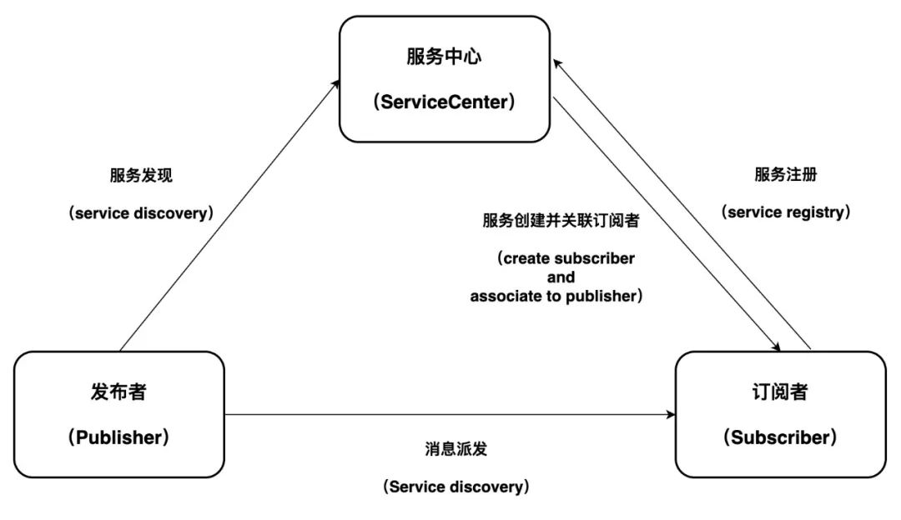
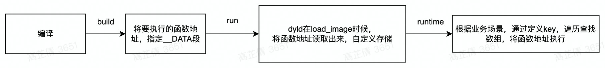
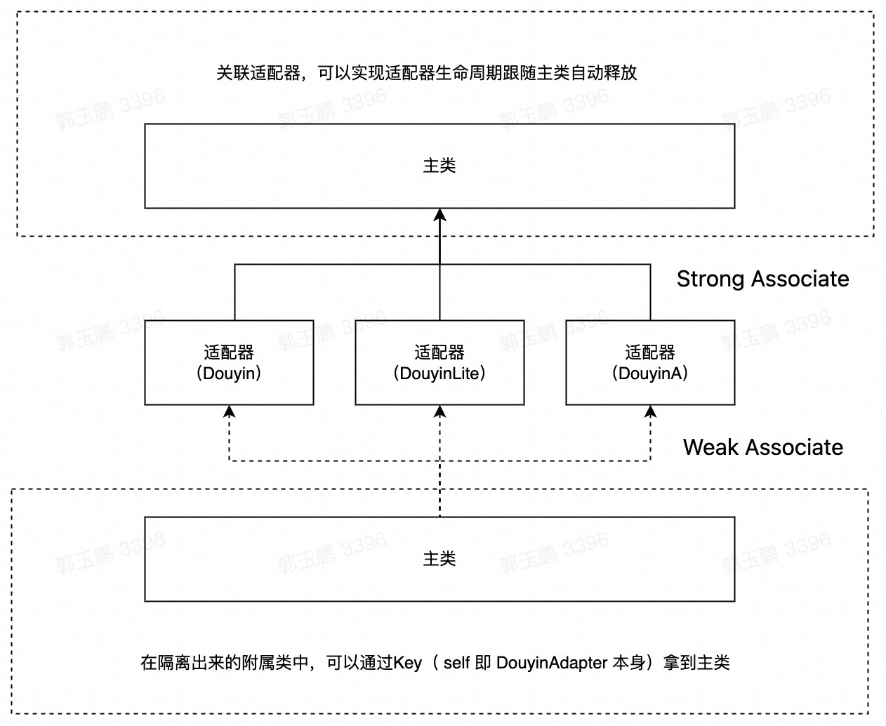

# 抖音平台多产物代码隔离技术的实践与探索
在软件架构领域，框架的功能类似于基础设施服务，是为实现某个业界标准而形成的组件规范。简单理解，框架就是制定一套规范或者规则，开发者在该规范或者规则下工作。  
**背景**  
随着抖音业务的发展，为保障整体工程演进和迭代计划的高效运行，体系化建设已加速提上日程，Codebase（可通称为产物）融合是其中项目之一。该项目主要为开发者提供底层复用能力、增强研发团队效能，致力于帮助开发同学轻松高效地研发、管理代码。  
Codebase 融合过程中，技术团队在各个业务线方向进行着差异化探索；演进路程上，业务线间耦合越来越强，开发同学迫切需要一套解决方案来做差异化代码隔离。  
回顾痛点，在过往的开发中，开发者们一般使用宏隔离（ isLite or isPad ）来区分不同产物之间的差异，但这种方式严重破坏了整个抖音工程的架构体系，以下从几个维度分析。  
- 研发效率：需要支持不同宏变量进行 lint ，有重复 lint ，单个组件很难区分项目控制二进制发版频率，二进制需要频繁更新，宏会导致很多混编二进制，影响编译效率，如果以单个文件作为编译缓存单元，宏隔离也会降低编译缓存命中率
- 可扩展性：扩展性差，缺乏动态能力和插件能力，添加新功能和修改原有功能会导致类实现的代码急剧膨胀
- 圈复杂度：宏隔离的代码分散，修改和重构成本高
- 组件粒度：无法支持项目间差异业务独立成组件，背离高内聚、低耦合原则

## 设计思想
**适配器模式**  
> 在设计模式中，适配器模式（adapter pattern）有时候也称包装样式或者包装。将一个类的接口转接成用户所期待的。一个适配使得因接口不兼容而不能在一起工作的类能在一起工作，做法是将类自己的接口包裹在一个已存在的类中。

开发者不用关心各个模块的复杂度、业务的逻辑性、是选择类对象还是实例对象、如何初始化各自单元等，仅需要基于包装好的适配器来做各自的任务调度，类似于万能充电器，无需关注电池是华为的，还是 OPPO 的，即插即用。  

**注册与发现**  
_微服务_
> 微服务是一种以业务功能为主的服务设计概念，每一个服务都具有自主运行的业务功能，对外开放不受语言限制的 API ，应用程序则是由一个或多个微服务组成

简单了解微服务后，以服务角度来看，多个 Target 产物根据各业务模块可划分为多个 Adapter 服务，搭配绑定多个适配器协议，这样能达成一对多效果  
在使用阶段，一个主类可以向多个适配器类发送消息；在注册过程，一个适配器类可以绑定到多个适配器协议，并且满足两种场景：一是多产物必须实现的接口，可以放在一个公共的协议上，二是单个产物必须实现的接口放在独立的协议上，公共协议 + 独立协议可以进行组合，由同一个有上下文关联的适配器类来实现。  

_服务注册_  
服务注册：是将提供某个服务的模块信息注册到一个公共的组件上去。
``` 
//服务注册
ServiceKit.register(AModuleServer);
```
_服务发现_  
服务发现：是指使用一个注册中心来记录分布式系统中的全部服务的信息，以便其他服务能够快速的找到这些已注册的服务；不管是服务新增和服务删减都能实现自动发现。（如下示例代码更加容易理解）  
``` 
//服务发现
ServiceKit.get(AModuleServer); 
```

**进阶图纸**  


- 蓝色框：抖音 Target
- 黑色框：抖音极速版 Target
- aXXXDOUYINAdapter：是 XXXDOUYINAdapterImpl 的服务实例。
- XXXDOUYINAdapterImpl：是订阅者，发布者是持有 XXXDOUYINAdapterImpl 实例 XXXDOUYINAdapter 的主类。
- <>XXXDOUYINAdapter：面向协议编程，抽象 Protocol 接口，抽离各自差异性、公共性代码的接口

> 上图再一步概括了整个项目背景（抖音、抖音极速版的两套代码，有重复也有差异，如何将重复的代码继续共用，并且将差异性的代码隔离到各自的Target产物中，不再耦合）、要做的过程（通过适配器模式来做任务调度，面向协议编程，抽离共用、差异性的代码为接口形式，在各自Target中，实现各自的协议Impl），以及达成的结果（通过便利性脚手架、辅助工具能让使用者低成本学习和理解，容易上手操作）

**关系图纸**  



**工程视角**  

  

**流程实战**  
代码实战中，订阅类在 App 内存创建一个实例，订阅者的生命周期由所有关联的发布者决定，比如多个控制器汇总埋点逻辑到一个加工者， 或比如一个父控制器对应多个子控制器。  


## 技术细节
**编译插拔**   
常规思路下，注册会放到 App 启动阶段，但这样做容易拖缓 App 的启动速度。要想做到在最早的时机注册但又不影响启动速度，需要基于编译器特性：__attribute__((section("name"))) 实现，通过 attribute 指令，编译时期写在 .data 段，然后在运行时期读出来。下图介绍编译注解的简单流程



代码示例  
``` 
__attribute((used, section(_DY_SEGMENT "," _DY_MSG_ASSOCIATE_SUBSCRIBER_SECTION ))) static _dy_message_pair _DY_MSG_UNIQUE_VAR = \
{\
&_DY_MSG_ASSOCIATE_PROTOCOL_METHOD(INDEX),\
&_DY_MSG_ASSOCIATE_LOGIC_METHOD,\
};
```
利用上述编译注解的能力，搭配协议反射，就能达到在使用的时候，get 协议进而读取到存储在 .data 段中的内存地址来加载，这个能力也称为懒加载。  

**支持切面**  
核心思路如下（伪代码），在注册阶段暴露出代码块模型，可以在块中做类似 AB 的逻辑切面  
``` 
isABTest = YES;

Register {
    if (isABTest) {
    return <ObjectABProtocol>ObjectA.new;
    } else {
    return <ObjectABProtocol>ObjectB.new;  
    }
}
```
**循环引用**  
防止 subscriber 与 publisher 在 block 使用或者主类与适配器的关联情况下导致循环引用，适配器底层运用了 NSProxy 来实现。如以下的 case 无需关心内存不释放问题  
- 场景例一
``` 
@implementation DYAudioViewForDOUYIN
RegisterAdapters(DYFeedInteractionControllerPrivateProtocol,DYFeedContaineAudioAdapter) {
  if (GET_AB_TEST_CASE(enableAutoPlay)) {
    return nil;
  } else {
    return [[DYAudioViewForDOUYIN alloc] init];
  }
}

- (void)stopAudio:(BOOL)immediate
{
  [[self weakTarget] refresh:^{
    [[self weakTarget] refresh];
    [self stop];
  }];
}

- (void)stop
{
    //do something
    ....
}

@end
```
- 场景例二
``` 
@implementation DYFeedContainer

GetAdapters(DYFeedContaineAudioAdapter,DYFeedContaineVideoAdapter, DYFeedModuleConfig)

- (void)stopPlay
{
  id <DYFeedContaineVideoAdapter> adapter = [self DYFeedContaineVideoAdapter];
  [[self DYFeedContaineVideoAdapter] stopVideo:^{
    [adapter refreshView];
  }];
   
  self.myBlock = ^(){
    [adapter refreshView];
  };
}

@end
```

**绑定关联**  
绑定关联共分为两部分，强关联与弱关联。  



- 强关联：将各适配器强绑定关联在主类上，这样能实现适配器的生命周期跟随主类自动释放，在使用适配器对象时让内存持续处于最优状态。
- 弱关联：将主类弱关联在适配器上，这样能实现在隔离出来的附属类中，通过 Key （ self = 适配器）拿到主类，达到反向通信的效果

**多语言适配**  
Swift 环境下不能在注册阶段友好的使用 attribute 编译指令，去自定义段能力，要想高性能的使用懒注册能力只能另辟蹊径  

> 将注册代码块直接放到 MachO 文件中的代码区，通过继承协议 SwiftAdapter ，实现层实现 + (id)lazyRegister 类方法，runtime 的 Api 映射出 A 类对象，在服务发现的阶段来调用 A 类方法代码，这样能解决“懒注册”问题；然后改造底层框架，控制内部保证只会初始化一次，用户视角无需关心

例子：
``` 
class ModuleADouYinLiteAdapter: NSObject,SwiftAdapterProtocol {
    class func lazyRegister() -> NSObjectProtocol {
       return ModuleADouYinLiteAdapter.init()
    }
}
```

**便利脚手架**  
> 在各语言环境对服务发现与注册接口制造脚手架，使其用起来更加简便
1. Objective - C 宏(接口均用宏来封装)
``` 
//服务注册
RegisterAdapters(ModuleDouYinLiteAdapter) {
 return ModuleDouYinLiteAdapter.new;
}
//服务发现
GetAdapters(ModuleDouYinLiteAdapter) 
```
2. Swift Protocol 扩展  
   Swift 环境下不能友好的使用宏封装，此时可以通过对 Protocol 进行扩展，以达到封装效果。
    ``` 
    //服务注册
    class func lazyRegister() -> NSObjectProtocol,ModuleDouYinLiteAdapterProtocol {
    return ModuleDouYinLiteAdapter.init()
    }
    //服务发现
    Protocol.getAdapter(self,ModuleDouYinLiteAdapterProtocol.self)
   ```

## 辅助工具
推荐使用 Xcode 自定义模板工具编程，让使用者减少打出代码的时间成本，在开发中更加聚焦处理编码逻辑。  

## 使用规范
在代码静态检查阶段进行代码的拦截矫正，同时基于现状列一下几个 Badcase 。  
场景例一
- 只进行了分支判断逻辑隔离，没做到代码隔离，这样会将判断逻辑带到主类，使让包大小增加
    ```
     // E.g. 错误示例
    - (void)masterFunction {
        if ([self DYFeedAModuleLiteAdapter]) {
        // lite code
        } else {
        // douyin or other Target code
        }
      }

    //--------------------------------------------------------------------------

    //E.g.正确示例
    - (void)masterFunction {
        [[self DYFeedAModuleAdapter] runFunction];
      }

    //各自Target实现runFunction协议方法
    //in douyin
    - (void)runFunction {
      // code
      }
      //in Lite
    - (void)runFunction {
      // code
    }
    ```

场景例二  
在同一个产物内，一个协议被多个类实现（ Debug 环境编译阶段会通过断言进行第一次拦截）  
``` 
// E.g. 错误示例( douyin targer)
@interface AModuleAdapter<AModuleAdapter>
@interface BModuleAdapter<AModuleAdapter>

//E.g.正确示例(douyin targer)
@interface AModuleAdapter<AModuleAdapter>
@interface BModuleAdapter<BModuleAdapter>
```
场景例三  
Adapter 方法在不同产品线下可能返回空值，如果想拿 Adapter 做 一些逻辑编码，需要提前判断是否为空  
``` 
 // E.g. 错误示例
- (DYAModuleFeedType)getType {
   return [[self DYModuleAdapter] checkType];
}

//E.g.正确示例
- (DYAModuleFeedType)getType {
   return [self DYModuleAdapter] ? [[self DYModuleAdapter] checkType]:/* 兜底逻辑 */;
}
```

参考:  
[抖音平台多产物代码隔离技术的实践与探索](https://mp.weixin.qq.com/s/fjeF3LLoGsPIQN4D3el67g)
