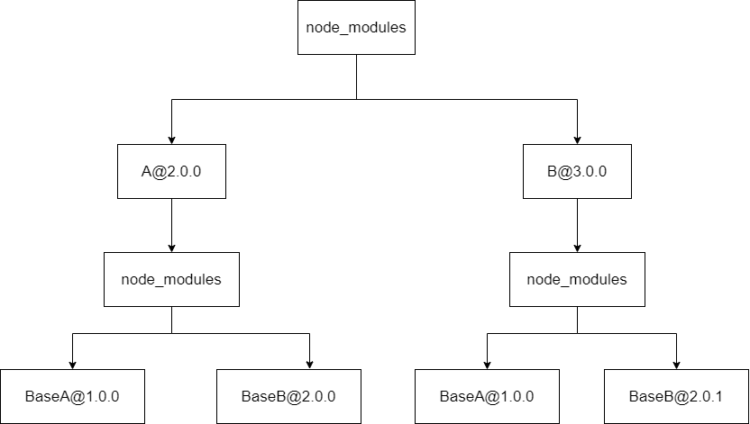
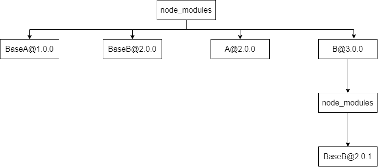

# 剖析 npm、yarn 与 pnpm 依赖管理逻辑
## npm2的依赖管理
npm2 安装依赖的时候比较简单直接，直接按照包依赖的树形结构下载填充本地目录结构。  
比如在项目中A和 C 都依赖 B，无论被依赖的 B 是否是同一个版本，都会直接无脑的生成对应的树结构，比如我们现在有下面的依赖：
- A@2.0.0：BaseA@1.0.0 BaseB@2.0.0
- B@3.0.0：BaseA@1.0.0 BaseB@2.0.1

那么npm i之后node_modules里面生成的内容将是下面这样的

这样的结构非常直观，但是有一个问题就是，如果项目的依赖过多的话，可能导致下面这些问题：  
1. 生成的依赖嵌套非常深
2. 相同版本的依赖大量冗余

## npm3/yarn的依赖管理
npm3对于npm2的情况进行了优化，那么如何进行优化呢？其实我们最直观的思路就是将树打平，将依赖扁平化，不就能解决嵌套过深和依赖冗余的问题。所以，在上面的例子中，如果我们用npm3来进行install，最后生成的node_modules会是这样的结构： 

这种依赖关系就导致了下面两个问题：  
1. 项目本身的node_modules结构不够直观
2. 依赖不安全，我们可以使用依赖文件中并没有声明的npm包

第一点的问题并不是很大，主要是第二点可能会导致一些奇怪的问题。
node_modules里面这两个包实际上是存在的，但是他们又不是永远存在的。万一有一天去除了这两个基础包的引用，node_modules里面将不再存在这两个基础包，那么我们的代码就会出问题，也就是代码啥也没动，放了一个晚上就坏了  
对于这种处理方式其实很容易有一个疑问，如果我同时引用了同一个包的多个不同版本，会帮我把哪个包提出来，同时我每次npm i之后提出来的包版本都是一样的吗？会不会存在这次是2.0.0版本下次是2.0.1版本的情况，比如我们下面这种情况：  
- A@1.0.0：BaseA@1.0.0 BaseB@2.0.0
- B@1.0.0：BaseA@1.0.0 BaseB@2.0.1
- D@1.0.0：BaseA@1.0.0 BaseB@2.0.1

会根据package.json里面的顺序，字典序在前面的npm包的底层依赖会被优先提出来

## pnpm的依赖管理
用pnpm再来安装一遍上面的依赖，会发现项目的node_modules文件夹只有当前package.json中所声明的各个依赖（的软连接），而真正的模块文件，存在于node_modules/.pnpm，由模块名@版本号形式的文件夹扁平化存储(解决依赖重复安装)。同时这样设计，也很好的避免了之前可以访问非法npm包的问题，因为当前项目的node_modules只有我们声明过的依赖，这也让node_modules里面的文件看起来非常的直观。  
同时，node_modules/.pnpm中存储的文件其实是pnpm实际缓存文件的「硬链接」，从而避免了多个项目带来多份相同文件引起的空间浪费问题  
但是说到硬链接，又有一个问题，这相当于所有项目都依赖了同一个文件，那么在一个项目中修改了某个npm包的文件，就会影响到其他项目，这对于postinstall是很不友好的。在不同项目中修改了某个npm包后会影响到其他项目。同时自己平时有时候也会直接在node_modules里面调试一些东西..感觉这种处理方式对于这种操作来说也不是很友好。  
从pnpm的官网来看，其实它默认会使用copy-on-write 的方式来进行处理，也就是如果你尝试对内容进行修改的话，会复制一份文件而不会影响到源文件。  
然后它不生效的原因似乎是因为libuv的bug：https://github.com/pnpm/pnpm/issues/2761，所以在copy-on-write不生效的情况下被回退到了hardlink  的方式去处理。  

原文:  
[剖析 npm、yarn 与 pnpm 依赖管理逻辑](https://mp.weixin.qq.com/s/3k4u-jw_iKsBeYyHJoSKMA)
